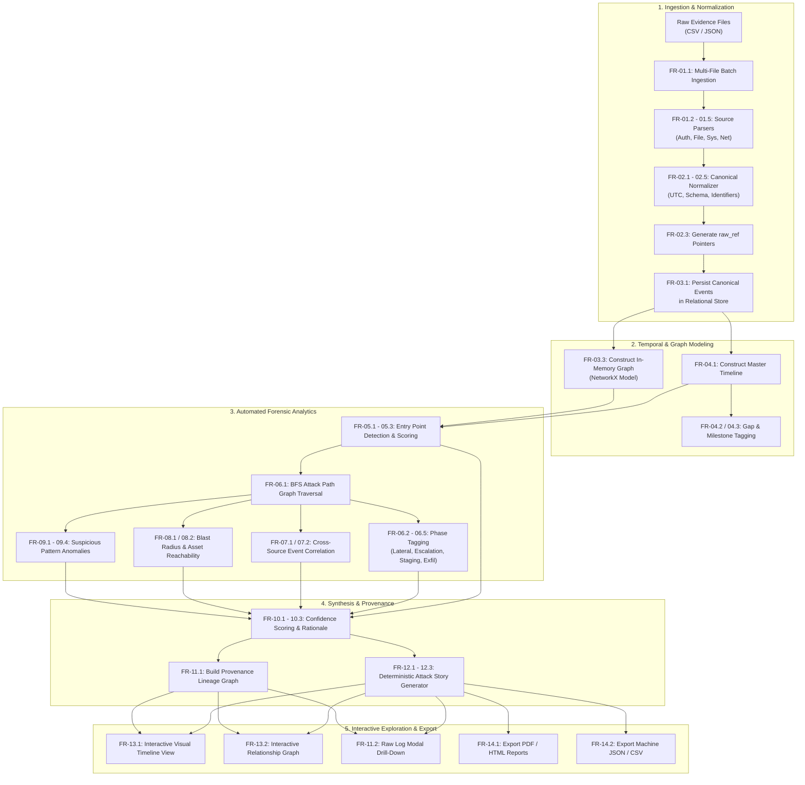

# Functional Requirements Specification (FRS)

**Project Name:** TraceLine — Automated Digital Forensics Reconstruction & Attack Story Pipeline  
**Document Version:** 1.0.0  
**Problem Statement ID:** PS-03 (X'O Code 2026)  
**Target Domain:** Tier-A Academic & Research Institution Digital Incident Response  
**Classification:** Technical / Implementation Specification  
**Status:** Approved for Architecture & Implementation  

---

## 1. Document Overview

### 1.1 Purpose
This Functional Requirements Specification (FRS) establishes the complete, authoritative functional baseline for **TraceLine**, an automated digital forensics reconstruction and narrative synthesis platform. TraceLine transforms disparate, multi-source log artifacts collected following a campus-wide cyber security breach into a verified, confidence-scored, evidence-cited attack timeline, asset blast radius, and defensible incident report.

This specification defines **what** the system shall do across all operational stages—from raw evidence ingestion to multi-format report generation—serving as the foundational contract for software architecture, backend/frontend engineering, algorithmic design, database modeling, and formal verification.

### 1.2 Document Conventions & Definitions
* **Shall / Must:** Indicates an absolute functional requirement necessary for system conformance and baseline viability.
* **Should:** Indicates a high-priority functional requirement that is strongly recommended and expected for production readiness.
* **Could:** Indicates an optional or stretch functional capability that enhances system depth without blocking core workflows.
* **Canonical Event:** A normalized data structure representing an atomic log record across all heterogeneous input types with unified field semantics.
* **Raw Reference (`raw_ref`):** A persistent, immutable pointer linking a canonical event or higher-level finding directly to the exact file path, row index, or record key of the original ingested log file.
* **Attack Story:** A deterministic, chronologically sequenced, natural-language narrative detailing an incident's execution path, citing supporting raw evidence for each asserted claim.
* **Blast Radius:** The aggregate boundary of physical, logical, and identity assets categorized as either directly compromised or exposed/at-risk via topological or privilege relationships.

### 1.3 Intended Audience
* **Software Architects & System Designers:** To construct component boundaries, data flow pipelines, graph processing structures, and API contracts.
* **Backend & Frontend Engineers:** To implement parsers, correlation engines, scoring heuristics, REST endpoints, and UI views.
* **Forensic Analysts & Evaluators:** To validate that the system satisfies domain requirements for chain-of-custody, determinism, and explainability.
* **Quality Assurance & Verification Teams:** To construct black-box, white-box, and end-to-end test suites directly from the acceptance criteria.

---

## 2. System Context

### 2.1 Problem Background
Following an intrusion into an academic and research institution's network infrastructure, incident response teams face thousands to hundreds of thousands of disconnected log entries across multiple operational silos (VPN/authentication logs, file server access audits, endpoint operating system events, and perimeter network flow records). 

Human analysts face three major bottlenecks:
1. **Cognitive Overload:** Sifting through heterogeneous timestamp formats, duplicate entries, and high-volume background noise.
2. **Correlation Complexity:** Connecting an initial credential stuffing attempt on a perimeter portal to subsequent lateral movement, privilege escalation, and staging of research data.
3. **The "Explainability Gap":** Traditional automated security tools and black-box AI often output alert scores or generic summaries without providing an unbroken, verifiable audit trail linking their conclusions back to physical log lines.

### 2.2 System Mission & The "Scatter-to-Story" Paradigm
TraceLine implements the **Scatter-to-Story** paradigm:

$$\text{Raw Logs} \longrightarrow \text{Normalized Events} \longrightarrow \text{Correlated Sequences} \longrightarrow \text{Scored Findings} \longrightarrow \text{Cited Attack Story}$$

The system operates under the core design principle that **confidence and provenance are first-class system outputs**. Every analytical deduction, entry-point hypothesis, and narrative statement must expose its underlying rationale and link directly to immutable raw evidence.

```
+---------------------------------------------------------------------------------------+
|                                    TRACELINE SYSTEM                                   |
|                                                                                       |
|  +--------------------+      +-----------------------+      +----------------------+  |
|  | Multi-Source Logs  | ---> | Ingestion & Schema    | ---> | Canonical Event      |  |
|  | (Auth, File, Sys,  |      | Normalization         |      | Store (SQLite/PG)    |  |
|  |  NetFlow)          |      |                       |      |                      |  |
|  +--------------------+      +-----------------------+      +----------+-----------+  |
|                                                                        |              |
|         +-------------------+--------------------+---------------------+              |
|         |                   |                    |                     |              |
|         v                   v                    v                     v              |
|  +---------------+   +---------------+    +--------------+      +--------------+      |
|  | Timeline &    |   | Entry Point   |    | Activity     |      | Cross-Source |      |
|  | Temporal Sync |   | Detection     |    | Graph Tracer |      | Correlation  |      |
|  +-------+-------+   +-------+-------+    +------+-------+      +------+-------+      |
|          |                   |                   |                     |              |
|          +-------------------+-------------------+---------------------+              |
|                                      |                                                |
|                                      v                                                |
|                        +---------------------------+                                  |
|                        | Blast Radius & Pattern    |                                  |
|                        | Anomaly Analyzers         |                                  |
|                        +-------------+-------------+                                  |
|                                      |                                                |
|                                      v                                                |
|                        +---------------------------+                                  |
|                        | Confidence Scoring Engine |                                  |
|                        | (Corroboration + Penalty) |                                  |
|                        +-------------+-------------+                                  |
|                                      |                                                |
|                                      v                                                |
|                        +---------------------------+                                  |
|                        | Deterministic Attack      |                                  |
|                        | Story Generator           |                                  |
|                        +-------------+-------------+                                  |
|                                      |                                                |
|                 +--------------------+--------------------+                           |
|                 v                                         v                           |
|      +---------------------+                   +---------------------+                |
|      | Interactive UI &    |                   | Multi-Format Export |                |
|      | Drill-Down Viewer   |                   | (PDF, HTML, JSON)   |                |
|      +---------------------+                   +---------------------+                |
+---------------------------------------------------------------------------------------+
```

---

## 3. Scope

### 3.1 In Scope
1. **Multi-Source Ingestion:** Batch ingestion of forensic log files in CSV and JSON formats covering at least four canonical source categories:
   * Authentication / Login Logs (SSO, Active Directory, RADIUS, SSH).
   * File Access & Storage Audit Logs (NFS, SMB, research repository access).
   * Host Operating System & Endpoint Events (Syslog, Windows Event Logs, process execution).
   * Network Flow / Firewall Records (Suricata/Snort alerts, NetFlow, proxy connection logs).
2. **Canonical Data Normalization:** Standardizing disparate timestamp encodings, time zones, identity strings, IP representations, and action verbs into a unified forensic event schema with persistent `raw_ref` links.
3. **Temporal Analysis & Timeline Construction:** Sorting events chronologically, identifying log latency/clock skew anomalies, and isolating temporal clusters.
4. **Initial Access Identification:** Evaluating heuristic indicators (e.g., authentication bursts, off-hours access, novel external IPs) to identify and rank candidate entry points with confidence metrics.
5. **Attack Path Tracing:** Constructing directed execution graphs (using BFS/graph traversal) connecting identity hops, endpoint transitions, privilege changes, and staging actions across attack phases.
6. **Cross-Source Event Correlation:** Grouping disparate events sharing user principals, source/destination IPs, host identifiers, and temporal proximity windows.
7. **Asset Blast Radius Computation:** Categorizing compromised versus reachable/at-risk accounts, servers, subnets, and critical research data files.
8. **Suspicious Behavioral Pattern Detection:** Rule-based identification of disguised admin accounts, off-hours data staging, unusual internal lateral connections, and mass egress volume.
9. **Deterministic Confidence Formulation:** Calculating High, Medium, and Low confidence ratings based on independent source corroboration, pattern clarity, and time continuity.
10. **Evidence Lineage & Provenance:** Providing end-to-end bidirectional navigation between high-level analytical claims and raw underlying log entries.
11. **Attack Narrative Generation:** Producing structured, human-readable forensic narratives with direct citations and explicit separation between observed facts and system inferences.
12. **Visual Dashboard & Multi-Format Reporting:** Rendering interactive web-based timelines and relationship graphs, with PDF, HTML, JSON, and CSV export capabilities.
13. **Flexible Schema Adaptation:** Mapping custom or instructor-provided CSV/JSON schemas to the canonical model without code changes.

### 3.2 Out of Scope
1. Real-time streaming log ingestion (e.g., live Kafka/Kinesis message bus ingestion) during the primary forensic batch run.
2. Automated active response, endpoint isolation, firewall rule injection, or dynamic containment.
3. Universal enterprise SIEM parsing covering proprietary, binary, or undocumented log schemas without a mapping definition.
4. Enterprise multi-tenancy, SAML/OIDC federated identity management, and granular multi-organization access control.
5. Non-deterministic, ungrounded LLM text generation that operates without strict template constraints or citation guarantees.

---

## 4. Actors and Users

| Actor Name | Description | Key System Interactions |
|---|---|---|
| **Forensic Investigator (Primary)** | Cybersecurity analyst or incident responder investigating the campus breach. | Uploads log packages, inspects reconstructed timelines, reviews attack paths, inspects raw evidence drill-downs, and customizes report exports. |
| **Incident Commander / Lead** | Senior security manager overseeing incident scope, compliance, and containment strategy. | Reviews executive summaries, assesses blast radius metrics, inspects high-level confidence assessments, and approves official findings. |
| **Academic / Executive Stakeholder** | Non-technical leadership (e.g., University Dean, General Counsel, CIO) requiring impact clarity. | Consumes synthesized PDF/HTML narrative reports focusing on breached research assets and exposure timelines. |
| **Dataset Administrator / Evaluator** | Instructor, benchmark evaluator, or system administrator providing test/synthetic datasets. | Uploads evaluation datasets, defines custom column mapping templates, and runs benchmark scenario validations. |
| **Core Analytical Pipeline (System Actor)** | The internal automated processing daemon comprising normalization, correlation, graph tracing, and scoring engines. | Ingests raw files, populates the unified event store, runs detection heuristics, computes graph metrics, and triggers narrative synthesis. |

---

## 5. Functional Requirements

```
                                  REQUIREMENTS HIERARCHY
                                  
  FR-01: Evidence Ingestion & Multi-Source Parsing
  FR-02: Data Normalization & Canonical Event Generation
  FR-03: Unified Event Store Management
  FR-04: Forensic Timeline Construction & Temporal Sync
  FR-05: Initial Access & Entry Point Identification
  FR-06: Attack Activity Tracing & Kill-Chain Reconstruction
  FR-07: Cross-Source Event Correlation
  FR-08: Blast Radius & Compromised Asset Impact Analysis
  FR-09: Suspicious Pattern & Anomaly Detection
  FR-10: Transparent Confidence Scoring & Justification
  FR-11: Evidence Lineage, Provenance & Drill-Down
  FR-12: Deterministic Attack Story Generation
  FR-13: Interactive Investigation Dashboard & UI Navigation
  FR-14: Multi-Format Reporting & Data Export
  FR-15: Flexible Schema Support & Dataset Adaptation
  FR-16: Investigation Session & Audit Logging
```

---

### FR-01: Evidence Ingestion and Multi-Source Parsing

#### FR-01.1: Multi-File Batch Evidence Ingestion
* **Requirement ID:** `FR-01.1`
* **Requirement Name:** Multi-File Batch Evidence Ingestion
* **Requirement Statement:** The system shall accept simultaneous batch uploads of multiple log files in CSV and JSON formats via both a web user interface and a REST API endpoint.
* **Description:** The system must allow investigators to upload an entire investigation package containing multiple independent log files representing different security data sources.
* **Rationale:** Forensic investigations require analyzing disparate log files from multiple hosts and perimeter devices collected during the incident window.
* **Inputs:** Array of raw log files (`.csv`, `.json`, `.jsonl`), optional dataset alias, upload metadata.
* **Processing / Behaviour:** Validates file formats, allocates an internal batch ingestion identifier, stages files in local investigation storage, and registers file descriptors in the tracking index.
* **Outputs:** Ingestion batch ID, file manifest, file validation status array.
* **Preconditions:** System storage is available and accessible.
* **Postconditions:** Raw files are staged immutably on disk with calculated SHA-256 integrity hashes.
* **Actors:** Forensic Investigator, Dataset Administrator, Core Analytical Pipeline.
* **Dependencies:** None.
* **Priority:** MUST.
* **Acceptance Criteria:** Successfully ingests a package of at least 10 log files totaling 100,000 rows across CSV and JSON formats without memory leakage or timeout.
* **Failure / Exception Handling:** If an unsupported file format is uploaded, the system shall reject the file, log a descriptive error, and allow remaining valid files in the batch to proceed.

#### FR-01.2: Authentication Log Parsing
* **Requirement ID:** `FR-01.2`
* **Requirement Name:** Authentication Log Parsing
* **Requirement Statement:** The system shall parse authentication and login log records to extract timestamps, source IP addresses, target user accounts, authentication protocol/service, and success/failure outcome indicators.
* **Description:** Extracts identity-centric event attributes from authentication sources such as Active Directory audits, SSH daemon logs, RADIUS authentications, and SSO portal records.
* **Rationale:** Authentication logs provide the foundational visibility required to detect unauthorized access, credential stuffing, and identity switching.
* **Inputs:** Staged authentication log file stream, delimiter configuration.
* **Processing / Behaviour:** Reads raw records, identifies standard auth field names, casts authentication outcomes to binary (`SUCCESS` / `FAILURE`), and extracts client IP addresses.
* **Outputs:** Structured intermediate authentication event stream.
* **Preconditions:** Log file staged via `FR-01.1`.
* **Postconditions:** Extracted records are forwarded to the canonical normalizer (`FR-02.1`).
* **Actors:** Core Analytical Pipeline.
* **Dependencies:** `FR-01.1`.
* **Priority:** MUST.
* **Acceptance Criteria:** Correctly parses valid CSV and JSON authentication logs, preserving raw row indexes and accurately mapping successful vs failed login flags.
* **Failure / Exception Handling:** Malformed lines or missing required fields shall be routed to the parsing quarantine log with specific line-number annotations.

#### FR-01.3: File Access & Storage Audit Log Parsing
* **Requirement ID:** `FR-01.3`
* **Requirement Name:** File Access & Storage Audit Log Parsing
* **Requirement Statement:** The system shall parse file access and storage audit logs to extract timestamps, acting user/process principals, target file paths, file operations (READ, WRITE, DELETE, RENAME, PERMISSION_CHANGE), and transferred byte volumes.
* **Description:** Ingests file system audit logs from academic storage servers, database export logs, and research repository file systems.
* **Rationale:** Identifying data staging and intellectual property exfiltration requires tracking all file-level interactions.
* **Inputs:** Staged file audit log stream.
* **Processing / Behaviour:** Parses log entries, extracts full target file paths, normalizes file operation verbs, and captures file size/byte transfer metrics where available.
* **Outputs:** Structured intermediate file access event stream.
* **Preconditions:** Log file staged via `FR-01.1`.
* **Postconditions:** Extracted records are forwarded to the canonical normalizer.
* **Actors:** Core Analytical Pipeline.
* **Dependencies:** `FR-01.1`.
* **Priority:** MUST.
* **Acceptance Criteria:** Correctly extracts file paths, user identities, and distinct read/write/delete actions from test storage datasets.
* **Failure / Exception Handling:** If target file paths contain non-standard encodings or escape characters, the system shall sanitize the string without truncating path segments.

#### FR-01.4: Host & System Event Log Parsing
* **Requirement ID:** `FR-01.4`
* **Requirement Name:** Host & System Event Log Parsing
* **Requirement Statement:** The system shall parse operating system and host event logs to extract timestamps, hostnames, process names, process command-line arguments, parent process IDs, service installations, and elevated execution flags.
* **Description:** Ingests OS telemetry (e.g., Linux Syslog, Windows Event Logs, auditd) capturing system-level execution context.
* **Rationale:** Tracing malware execution, privilege escalation, and persistence requires fine-grained process execution visibility.
* **Inputs:** Staged system log file stream.
* **Processing / Behaviour:** Tokenizes host log records, extracts process hierarchies, identifies security event codes (e.g., service creation, cron additions), and tags local system identities.
* **Outputs:** Structured intermediate host event stream.
* **Preconditions:** Log file staged via `FR-01.1`.
* **Postconditions:** Extracted records are forwarded to the canonical normalizer.
* **Actors:** Core Analytical Pipeline.
* **Dependencies:** `FR-01.1`.
* **Priority:** MUST.
* **Acceptance Criteria:** Successfully extracts process names, command-line arguments, and host identifiers from system event logs.
* **Failure / Exception Handling:** If process command-line arguments are truncated in the raw log, the system shall capture available text and flag the record as partially truncated.

#### FR-01.5: Network Traffic and Flow Log Parsing
* **Requirement ID:** `FR-01.5`
* **Requirement Name:** Network Traffic and Flow Log Parsing
* **Requirement Statement:** The system shall parse network flow, firewall, and proxy connection logs to extract timestamps, source IP addresses, source ports, destination IP addresses, destination ports, protocols, and transferred byte counts.
* **Description:** Processes network perimeter and internal segment traffic records to detect lateral network hops and external data exfiltration conduits.
* **Rationale:** Network flows link disconnected host activities and reveal command-and-control (C2) or data egress connections.
* **Inputs:** Staged network flow log stream.
* **Processing / Behaviour:** Parses network records, maps IP/port tuples, validates IPv4/IPv6 address syntax, and aggregates bidirectional packet/byte counts.
* **Outputs:** Structured intermediate network event stream.
* **Preconditions:** Log file staged via `FR-01.1`.
* **Postconditions:** Extracted records are forwarded to the canonical normalizer.
* **Actors:** Core Analytical Pipeline.
* **Dependencies:** `FR-01.1`.
* **Priority:** MUST.
* **Acceptance Criteria:** Correctly parses standard NetFlow/firewall CSV/JSON tables into structured network socket interaction records.
* **Failure / Exception Handling:** If IP addresses fail standard formatting checks, the system shall mark the record as invalid and record an unparseable IP warning.

#### FR-01.6: Ingestion Status Tracking and Summary Reporting
* **Requirement ID:** `FR-01.6`
* **Requirement Name:** Ingestion Status Tracking and Summary Reporting
* **Requirement Statement:** The system shall maintain real-time ingestion state and generate an ingestion summary detailing total records parsed, valid records normalized, quarantined malformed records, and detected data-quality warnings.
* **Description:** Provides transparency into the health and completeness of the log ingestion process.
* **Rationale:** Forensic validity requires verifying that no critical evidence was silently dropped during ingestion.
* **Inputs:** Processing metrics from parsers `FR-01.2` through `FR-01.5`.
* **Processing / Behaviour:** Computes row counts, error frequencies, and schema adherence metrics; produces a structured JSON summary.
* **Outputs:** Ingestion status object (`total_rows`, `parsed_rows`, `quarantined_rows`, `error_details`).
* **Preconditions:** Ingestion job initiated.
* **Postconditions:** Ingestion report persisted and made available via the investigation API and dashboard.
* **Actors:** Forensic Investigator, Core Analytical Pipeline.
* **Dependencies:** `FR-01.1` to `FR-01.5`.
* **Priority:** MUST.
* **Acceptance Criteria:** The status report accurately reflects exact line counts and quarantine counts across all uploaded files.
* **Failure / Exception Handling:** In the event of a critical pipeline abort, the system shall record the exact failure offset and last successfully processed row.

---

### FR-02: Data Normalization and Canonical Event Generation

#### FR-02.1: Canonical Schema Generation
* **Requirement ID:** `FR-02.1`
* **Requirement Name:** Canonical Schema Generation
* **Requirement Statement:** The system shall map every parsed log entry into a standardized Canonical Event data object comprising: `event_id`, `timestamp`, `actor`, `target`, `action`, `source_type`, `raw_ref`, and `metadata`.
* **Description:** Implements a unified data model that collapses all domain-specific log types into a consistent forensic tuple.
* **Rationale:** A single canonical schema enables downstream correlation, graph traversal, and narrative generation engines to operate agnostically across all log sources.
* **Inputs:** Intermediate structured event records from all parsers.
* **Processing / Behaviour:** Instantiates a canonical event record, assigns a globally unique UUID `event_id`, assigns the standardized action taxonomy (e.g., `AUTHENTICATE`, `EXECUTE`, `READ`, `WRITE`, `CONNECT`, `ESCALATE`), and encapsulates domain-specific attributes into the `metadata` JSON object.
* **Outputs:** Validated Canonical Event instance.
* **Preconditions:** Parsers have extracted field values.
* **Postconditions:** Canonical event is ready for database persistence (`FR-03.1`).
* **Actors:** Core Analytical Pipeline.
* **Dependencies:** `FR-01.2`, `FR-01.3`, `FR-01.4`, `FR-01.5`.
* **Priority:** MUST.
* **Acceptance Criteria:** 100% of non-quarantined raw events are transformed into canonical objects adhering strictly to the schema specification.
* **Failure / Exception Handling:** If a record cannot be mapped to the canonical schema due to missing mandatory fields, it is logged and relegated to the unmapped records pool.

#### FR-02.2: Universal Timestamp and Timezone Normalization
* **Requirement ID:** `FR-02.2`
* **Requirement Name:** Universal Timestamp and Timezone Normalization
* **Requirement Statement:** The system shall parse heterogeneous timestamp formats (including ISO 8601, RFC 2822, UNIX epoch milliseconds, and standard syslog formats) and convert all timestamps into UTC with microsecond precision.
* **Description:** Resolves varied timestamp representations and adjusts for explicit or configured timezone offsets to achieve a unified temporal baseline.
* **Rationale:** Accurate forensic timeline construction is impossible if source systems report in differing timezones or unnormalized formats.
* **Inputs:** Raw timestamp string or numeric value, optional default source timezone parameter.
* **Processing / Behaviour:** Applies multi-pattern regex timestamp parsing, converts local offsets to UTC, standardizes output to ISO 8601 string (`YYYY-MM-DDTHH:MM:SS.ffffffZ`), and records the original timezone in event metadata.
* **Outputs:** Standardized UTC timestamp object.
* **Preconditions:** Raw timestamp field is present in the record.
* **Postconditions:** Canonical event contains a normalized UTC timestamp.
* **Actors:** Core Analytical Pipeline.
* **Dependencies:** `FR-02.1`.
* **Priority:** MUST.
* **Acceptance Criteria:** Correctly parses and converts at least 6 distinct timestamp formats into identical UTC representations.
* **Failure / Exception Handling:** If a timestamp string cannot be resolved, the system shall flag the event with `timestamp_uncertain=True`, assign it a null sort key, and log a warning.

#### FR-02.3: Persistent Raw Reference (`raw_ref`) Pointer Generation
* **Requirement ID:** `FR-02.3`
* **Requirement Name:** Persistent Raw Reference Pointer Generation
* **Requirement Statement:** The system shall generate an immutable `raw_ref` pointer for every canonical event containing: `source_file_id`, `line_number` (or record index), and the SHA-256 hash of the raw log line.
* **Description:** Creates an unbreakable forensic link between every normalized event and the exact physical record from which it originated.
* **Rationale:** Fulfills the core design requirement of evidence explainability and legal auditability, allowing analysts to verify automated claims against ground-truth logs.
* **Inputs:** Source file identifier, file row/byte offset, raw string content of the source record.
* **Processing / Behaviour:** Constructs a structured `raw_ref` dictionary/string and embeds it within the canonical event model.
* **Outputs:** Fully populated `raw_ref` property.
* **Preconditions:** Raw file is staged and indexed.
* **Postconditions:** Canonical event is cryptographically and positionally linked to raw storage.
* **Actors:** Core Analytical Pipeline.
* **Dependencies:** `FR-01.1`, `FR-02.1`.
* **Priority:** MUST.
* **Acceptance Criteria:** Given any canonical event ID, querying the `raw_ref` returns the exact byte-for-byte original log line from the ingested file.
* **Failure / Exception Handling:** If raw line indexing fails, the ingestion transaction for that batch is rolled back to prevent orphaned records.

#### FR-02.4: Identity and Username Canonicalization
* **Requirement ID:** `FR-02.4`
* **Requirement Name:** Identity and Username Canonicalization
* **Requirement Statement:** The system shall normalize user identities by stripping domain prefixes/suffixes, converting characters to lowercase, and mapping known service account aliases to their primary identity.
* **Description:** Standardizes user identifiers (e.g., `CAMPUS\jdoe`, `jdoe@university.edu`, `JDOE`, and `jdoe`) into a consistent principal string (`jdoe`).
* **Rationale:** Attackers exploit naming variations across systems; normalization ensures all activities under the same account are correctly correlated.
* **Inputs:** Raw username or actor string.
* **Processing / Behaviour:** Trims whitespace, strips Kerberos/NTLM domain qualifiers, applies case-folding, and queries an optional user alias mapping table.
* **Outputs:** Canonical `actor` string.
* **Preconditions:** Raw actor field parsed.
* **Postconditions:** Normalized username populated in canonical event.
* **Actors:** Core Analytical Pipeline.
* **Dependencies:** `FR-02.1`.
* **Priority:** MUST.
* **Acceptance Criteria:** Standardizes multiple variants of the same user identity to an identical string across all log types.
* **Failure / Exception Handling:** If an actor field is anonymous, blank, or system-generated (`SYSTEM`, `N/A`), it is assigned a reserved `ANONYMOUS` or `LOCAL_SYSTEM` taxonomy tag.

#### FR-02.5: IP Address and Host Identifier Standardization
* **Requirement ID:** `FR-02.5`
* **Requirement Name:** IP Address and Host Identifier Standardization
* **Requirement Statement:** The system shall normalize IP addresses to standard dot-decimal IPv4 or expanded IPv6 notation, classify them as Internal/RFC-1918 or External, and standardize fully qualified domain names (FQDNs) to lowercase hostnames.
* **Description:** Formats network addresses and hostnames to facilitate topological graph construction and subnet-level correlation.
* **Rationale:** Distinguishing internal campus subnets from external internet IP addresses is vital for identifying initial ingress and subsequent egress.
* **Inputs:** Raw IP address strings, raw hostname strings.
* **Processing / Behaviour:** Parses IP strings through network address validators, classifies IP scope (Private/Public/Loopback), and normalizes hostnames.
* **Outputs:** Standardized network and host attributes in canonical metadata.
* **Preconditions:** Network/host fields extracted.
* **Postconditions:** IP and host fields populated in canonical format.
* **Actors:** Core Analytical Pipeline.
* **Dependencies:** `FR-02.1`.
* **Priority:** MUST.
* **Acceptance Criteria:** Correctly identifies private campus IPs versus external attacker IPs and normalizes uppercase hostnames.
* **Failure / Exception Handling:** Invalid or unresolvable IP strings are preserved as raw text in metadata with an `invalid_ip_format` tag.

---

### FR-03: Unified Event Store Management

#### FR-03.1: Relational Canonical Event Storage
* **Requirement ID:** `FR-03.1`
* **Requirement Name:** Relational Canonical Event Storage
* **Requirement Statement:** The system shall persist all canonical events in a relational event store featuring indexed columns for `event_id`, `timestamp`, `actor`, `target`, `action`, `source_type`, and a JSON column for `metadata` and `raw_ref`.
* **Description:** Provides a persistent, high-performance queryable repository for all normalized security events.
* **Rationale:** Downstream analytical modules require rapid filtering and indexing across time ranges, actors, and targets.
* **Inputs:** Batch of Canonical Event objects.
* **Processing / Behaviour:** Executes bulk database inserts into the `events` table with database transactions, populating indexes on `(timestamp)`, `(actor, timestamp)`, and `(target, timestamp)`.
* **Outputs:** Database write confirmation, persistent record count.
* **Preconditions:** Relational database initialized with target schema.
* **Postconditions:** Events are persisted and immediately queryable.
* **Actors:** Core Analytical Pipeline.
* **Dependencies:** `FR-02.1`.
* **Priority:** MUST.
* **Acceptance Criteria:** Bulk loads 100,000 canonical events into the local database within 10 seconds.
* **Failure / Exception Handling:** Database write errors trigger transaction rollback and raise an alert in the ingestion log.

#### FR-03.2: Raw Record Archive Storage
* **Requirement ID:** `FR-03.2`
* **Requirement Name:** Raw Record Archive Storage
* **Requirement Statement:** The system shall store the exact, unmodified raw source files in an immutable archive storage volume accessible via internal file key lookup.
* **Description:** Manages the physical persistence of raw evidence files for verification and drill-down retrieval.
* **Rationale:** Required to satisfy legal chain-of-custody and ensure raw logs are never modified during normalization.
* **Inputs:** Raw file streams from `FR-01.1`.
* **Processing / Behaviour:** Writes files to a dedicated read-only filesystem directory, indexing file metadata (`file_id`, `filename`, `byte_size`, `sha256_hash`, `upload_timestamp`).
* **Outputs:** Registered raw archive records.
* **Preconditions:** Ingestion initiated.
* **Postconditions:** Raw files are locked in read-only mode.
* **Actors:** Core Analytical Pipeline.
* **Dependencies:** `FR-01.1`.
* **Priority:** MUST.
* **Acceptance Criteria:** Raw archive files match original upload SHA-256 hashes perfectly.
* **Failure / Exception Handling:** If storage write permissions fail, the ingestion process is immediately aborted.

#### FR-03.3: In-Memory Graph Event Representation
* **Requirement ID:** `FR-03.3`
* **Requirement Name:** In-Memory Graph Event Representation
* **Requirement Statement:** The system shall construct an in-memory directed property graph representing entities (Users, Hosts, IPs, Files) as nodes and canonical events as directed, timestamped edges.
* **Description:** Translates relational event data into an in-process graph structure (using NetworkX) for high-speed topological traversal.
* **Rationale:** Graph traversal enables rapid multi-hop lateral movement tracing and blast radius reachability analysis without complex SQL recursive joins.
* **Inputs:** Queried canonical events from the event store.
* **Processing / Behaviour:** Instantiates graph nodes for distinct actors, IP addresses, systems, and file entities; adds directed edges annotated with `timestamp`, `action`, and `event_id`.
* **Outputs:** In-memory directed graph instance.
* **Preconditions:** Events persisted in relational store.
* **Postconditions:** Graph available in memory for analytical modules (`FR-06`, `FR-08`).
* **Actors:** Core Analytical Pipeline.
* **Dependencies:** `FR-03.1`.
* **Priority:** SHOULD.
* **Acceptance Criteria:** Correctly builds an in-memory graph of 50,000 edges and supports breadth-first search path traversal in under 500ms.
* **Failure / Exception Handling:** If graph construction exceeds memory limits, the system falls back to indexed SQL join queries.

---

### FR-04: Forensic Timeline Construction and Temporal Sync

#### FR-04.1: Unified Chronological Event Sorting
* **Requirement ID:** `FR-04.1`
* **Requirement Name:** Unified Chronological Event Sorting
* **Requirement Statement:** The system shall assemble all normalized canonical events into a single, globally sorted chronological timeline ordered by normalized UTC timestamp ascending.
* **Description:** Establishes the macro-level timeline of all activities occurring across the institutional infrastructure during the incident window.
* **Rationale:** A single timeline allows investigators to observe cross-system causality and sequence of events.
* **Inputs:** Canonical event dataset.
* **Processing / Behaviour:** Executes an efficient multi-key sort on `(timestamp ASC, event_id ASC)` to guarantee deterministic tie-breaking for concurrent events.
* **Outputs:** Sorted master timeline sequence.
* **Preconditions:** Events normalized and stored.
* **Postconditions:** Master timeline sequence cached for analysis and visualization.
* **Actors:** Core Analytical Pipeline, Forensic Investigator.
* **Dependencies:** `FR-02.2`, `FR-03.1`.
* **Priority:** MUST.
* **Acceptance Criteria:** 100% of events are sorted in strict ascending chronological order; identical timestamps are deterministically ordered.
* **Failure / Exception Handling:** Events with uncertain timestamps are placed in an isolated auxiliary timeline category and flagged in the UI.

#### FR-04.2: Temporal Gap and Activity Burst Detection
* **Requirement ID:** `FR-04.2`
* **Requirement Name:** Temporal Gap and Activity Burst Detection
* **Requirement Statement:** The system shall analyze the sorted timeline to identify statistically significant temporal inactivity gaps (> configurable threshold $T_{gap}$) and dense activity bursts (> $N_{events}$ within window $W_{burst}$).
* **Description:** Flags sudden lulls in logging or massive surges in activity indicating automated scripting, brute force attacks, or log tampering.
* **Rationale:** High-density bursts often indicate automated tools, while sudden gaps may signify attacker anti-forensics or system reboots.
* **Inputs:** Sorted timeline sequence, configurable parameters ($T_{gap} = 3600\text{s}$, $W_{burst} = 60\text{s}$, $N_{burst} = 50$).
* **Processing / Behaviour:** Iterates over chronological intervals, computing event frequency deltas; generates `TIMELINE_ANOMALY` records when thresholds are crossed.
* **Outputs:** Array of timeline anomaly markers with start/end timestamps and severity ratings.
* **Preconditions:** Master timeline generated (`FR-04.1`).
* **Postconditions:** Timeline anomalies marked on dashboard view.
* **Actors:** Core Analytical Pipeline.
* **Dependencies:** `FR-04.1`.
* **Priority:** SHOULD.
* **Acceptance Criteria:** Successfully flags injected 2-hour log gaps and 100-events/minute brute-force bursts in test datasets.
* **Failure / Exception Handling:** If baseline log frequency is uniform, no anomaly markers are emitted.

#### FR-04.3: Milestone Candidate Event Tagging
* **Requirement ID:** `FR-04.3`
* **Requirement Name:** Milestone Candidate Event Tagging
* **Requirement Statement:** The system shall automatically evaluate canonical events and tag candidate "Milestone Events" representing pivotal state changes, including: first external login, first privilege elevation, first file staging, and first outbound data transfer.
* **Description:** Identifies key transitional moments in the attack lifecycle to anchor the narrative generator.
* **Rationale:** Summarizing an attack requires highlighting major operational transitions rather than displaying every trivial log line.
* **Inputs:** Sorted timeline, event action classifications.
* **Processing / Behaviour:** Evaluates state-change rules across the event sequence; marks matching canonical events with a `is_milestone=True` flag and milestone category label.
* **Outputs:** Tagged milestone event list.
* **Preconditions:** Master timeline generated.
* **Postconditions:** Milestone events prioritized in narrative synthesis (`FR-12.1`).
* **Actors:** Core Analytical Pipeline.
* **Dependencies:** `FR-04.1`.
* **Priority:** MUST.
* **Acceptance Criteria:** Automatically identifies and tags at least 4 key milestone events in a known ground-truth attack scenario.
* **Failure / Exception Handling:** If no milestone rules match, the system falls back to the earliest suspicious event.

---

### FR-05: Initial Access and Entry Point Identification

#### FR-05.1: Failed Login Burst Followed by Success Detection
* **Requirement ID:** `FR-05.1`
* **Requirement Name:** Failed Login Burst Followed by Success Detection
* **Requirement Statement:** The system shall detect sequences where $K$ or more failed authentication events for an account or from an IP address are followed within time window $W_{auth}$ by a successful authentication event.
* **Description:** Identifies classic credential guessing, password spraying, or brute force entry patterns.
* **Rationale:** External brute force is the most common entry vector in academic credential compromise incidents.
* **Inputs:** Canonical authentication events, parameters ($K = 5$, $W_{auth} = 900\text{s}$).
* **Processing / Behaviour:** Tracks rolling failure counts per `(actor, source_ip)`; detects subsequent `SUCCESS` event; computes initial access risk score based on failure volume and time compression.
* **Outputs:** `INITIAL_ACCESS_CANDIDATE` finding containing actor, source IP, failure count, timestamp, and supporting event IDs.
* **Preconditions:** Authentication logs ingested and normalized.
* **Postconditions:** Finding registered in candidate entry point registry.
* **Actors:** Core Analytical Pipeline.
* **Dependencies:** `FR-02.1`, `FR-04.1`.
* **Priority:** MUST.
* **Acceptance Criteria:** Triggers an entry point finding when 5 failed logins precede a successful login from the same external IP within 15 minutes.
* **Failure / Exception Handling:** If failure events originate from internal service accounts, the finding is weighted lower to avoid false positives.

#### FR-05.2: Anomaly-Based First-Seen Access Detection
* **Requirement ID:** `FR-05.2`
* **Requirement Name:** Anomaly-Based First-Seen Access Detection
* **Requirement Statement:** The system shall detect successful external logins originating from IP addresses, geographic subnets, or user-agent profiles never previously observed in the baseline authentication history.
* **Description:** Flags anomalous ingress connections that succeed without prior brute force (e.g., valid credentials obtained via external phishing).
* **Rationale:** Sophisticated attackers often enter using purchased or phished valid credentials on their first attempt.
* **Inputs:** Authentication events, historical IP/subnet baseline cache.
* **Processing / Behaviour:** Compares incoming successful login attributes against baseline sets; computes an anomaly weight based on IP novelty and time of access.
* **Outputs:** `NOVEL_INGRESS_CANDIDATE` finding with IP, user, timestamp, and novelty rationale.
* **Preconditions:** Baseline identity-to-IP profiles initialized.
* **Postconditions:** Finding registered in candidate entry point registry.
* **Actors:** Core Analytical Pipeline.
* **Dependencies:** `FR-02.5`, `FR-04.1`.
* **Priority:** MUST.
* **Acceptance Criteria:** Successfully flags an initial successful login from an unknown external IP address during off-hours (02:00–05:00).
* **Failure / Exception Handling:** If historical baseline is absent, all external IP logins are treated with equal exploratory weight.

#### FR-05.3: Entry Point Scoring and Candidate Ranking
* **Requirement ID:** `FR-05.3`
* **Requirement Name:** Entry Point Scoring and Candidate Ranking
* **Requirement Statement:** The system shall score all candidate entry points using a composite heuristic formula and output a ranked list of candidate initial compromise vectors with explicit confidence values.
* **Description:** Synthesizes multiple entry point indicators into a ranked list of probable root causes.
* **Rationale:** Investigators need a clear, prioritized starting point rather than unranked alerts.
* **Inputs:** Candidate findings from `FR-05.1`, `FR-05.2`, and system ingress telemetry.
* **Processing / Behaviour:** Calculates score $S_{entry} = w_1(\text{BruteForce}) + w_2(\text{NovelIP}) + w_3(\text{TemporalEarly}) + w_4(\text{FollowOnActivity})$; normalizes score to $[0.0, 1.0]$; assigns confidence tier (High/Medium/Low).
* **Outputs:** Ranked array of Initial Entry Point objects: `{rank, actor, source_ip, target_system, timestamp, vector_type, confidence_score, confidence_label, rationale, evidence_refs}`.
* **Preconditions:** Candidate entry points identified.
* **Postconditions:** Top-ranked entry point set as root node for attack tracing (`FR-06.1`).
* **Actors:** Core Analytical Pipeline, Forensic Investigator.
* **Dependencies:** `FR-05.1`, `FR-05.2`, `FR-10.1`.
* **Priority:** MUST.
* **Acceptance Criteria:** Ranks the true initial breach event as the #1 candidate in benchmark test scenarios with confidence $\ge \text{Medium}$.
* **Failure / Exception Handling:** If no candidate meets the threshold, the system flags the earliest recorded external connection as an uncertain entry point.

---

### FR-06: Attack Activity Tracing and Kill-Chain Reconstruction

#### FR-06.1: Breadth-First Graph Traversal Attack Path Tracing
* **Requirement ID:** `FR-06.1`
* **Requirement Name:** Breadth-First Graph Traversal Attack Path Tracing
* **Requirement Statement:** The system shall execute a forward directed graph traversal (Breadth-First Search) starting from the confirmed or top-ranked Initial Entry Point, propagating along shared actor, IP, host, and session edges within a forward time-bounding window $\Delta T_{trace}$.
* **Description:** Automatically discovers all subsequent actions performed by the adversary across systems following the initial breach.
* **Rationale:** Manually tracing hops across dozens of systems is time-consuming and prone to missing subtle pivoting steps.
* **Inputs:** Root entry point event ID, in-memory event graph (`FR-03.3`), maximum forward hop window ($\Delta T_{trace} = 72\text{ hours}$).
* **Processing / Behaviour:** Initializes BFS queue with root node; iteratively discovers adjacent nodes sharing attributes where $t_{edge} \ge t_{parent}$ and $t_{edge} \le t_{parent} + \Delta T_{trace}$; constructs a directed Attack Execution Tree.
* **Outputs:** Directed Attack Path Graph containing ordered nodes, edges, timestamps, and supporting event IDs.
* **Preconditions:** Root entry point identified and graph initialized.
* **Postconditions:** Attack path tree persisted for blast radius analysis and narrative generation.
* **Actors:** Core Analytical Pipeline.
* **Dependencies:** `FR-03.3`, `FR-05.3`.
* **Priority:** MUST.
* **Acceptance Criteria:** Successfully traces a 5-hop attack path (Ingress -> Lateral SSH -> User Escalation -> File Read -> SCP Egress) from ground-truth test data.
* **Failure / Exception Handling:** If graph traversal encounters cycles, the system terminates the cyclic path branch and logs a loop resolution note.

#### FR-06.2: Lateral Movement Detection
* **Requirement ID:** `FR-06.2`
* **Requirement Name:** Lateral Movement Detection
* **Requirement Statement:** The system shall identify lateral movement events where a compromised identity or internal host initiates remote authentication or command execution (via SSH, RDP, SMB/WMI, or PsExec) to a distinct internal target host.
* **Description:** Identifies and tags hops where the adversary spreads laterally across the internal institutional network.
* **Rationale:** Lateral movement distinguishes localized endpoint infections from widespread network compromises.
* **Inputs:** Traced event sub-graph, internal network subnet definitions.
* **Processing / Behaviour:** Evaluates cross-host events; verifies that source and destination are distinct internal hosts; verifies authentication/session linkage; tags edge with `PHASE: LATERAL_MOVEMENT`.
* **Outputs:** Lateral movement findings array with source host, target host, protocol, actor, timestamp, and evidence links.
* **Preconditions:** Attack path traced (`FR-06.1`).
* **Postconditions:** Lateral movement hops tagged in timeline and graph.
* **Actors:** Core Analytical Pipeline.
* **Dependencies:** `FR-06.1`.
* **Priority:** MUST.
* **Acceptance Criteria:** Accurately flags all internal SSH/RDP connections originating from compromised hosts within the attack window.
* **Failure / Exception Handling:** Routine automated administrative service connections are de-prioritized if they match known whitelisted management hosts.

#### FR-06.3: Privilege Escalation Identification
* **Requirement ID:** `FR-06.3`
* **Requirement Name:** Privilege Escalation Identification
* **Requirement Statement:** The system shall identify privilege escalation events where an identity transitions from a standard user role to elevated or administrative privileges (e.g., `sudo`, `su`, Windows UAC bypass, SYSTEM token impersonation, or addition to `sudoers`/Domain Admins).
* **Description:** Detects the moment an attacker gains administrative control over a system.
* **Rationale:** Privilege escalation represents a critical severity elevation in the attack lifecycle.
* **Inputs:** Traced host and authentication events.
* **Processing / Behaviour:** Detects transitions where $Role(t_2) > Role(t_1)$ for the same session or host context; flags process execution involving privilege modification binaries; tags event with `PHASE: PRIVILEGE_ESCALATION`.
* **Outputs:** Privilege escalation findings object containing previous role, new role, executing actor, host, command line, and evidence references.
* **Preconditions:** Host event logs ingested and traced.
* **Postconditions:** Escalation milestone registered and highlighted.
* **Actors:** Core Analytical Pipeline.
* **Dependencies:** `FR-01.4`, `FR-06.1`.
* **Priority:** MUST.
* **Acceptance Criteria:** Correctly detects `sudo su` execution and unauthorized additions to administrative groups in benchmark datasets.
* **Failure / Exception Handling:** Legitimate, scheduled system maintenance scripts running as root are filtered if no prior malicious precursor exists on that host.

#### FR-06.4: Persistence Mechanism Identification
* **Requirement ID:** `FR-06.4`
* **Requirement Name:** Persistence Mechanism Identification
* **Requirement Statement:** The system shall detect persistence installation actions occurring on compromised hosts, including: creation of scheduled tasks/cron jobs, installation of new system services, modification of startup scripts, and creation of backdoor accounts.
* **Description:** Identifies techniques used by the attacker to maintain persistent access across system reboots.
* **Rationale:** Remediation requires identifying and eliminating all persistence footholds installed during the breach.
* **Inputs:** Traced host system events, account management logs.
* **Processing / Behaviour:** Inspects file modifications in system startup directories, registry run keys, cron table updates, and new local user creation events; tags matching events with `PHASE: PERSISTENCE`.
* **Outputs:** Persistence mechanism findings array detailing mechanism type, target configuration path/account, host, timestamp, and evidence pointers.
* **Preconditions:** Host logs parsed and linked in attack trace.
* **Postconditions:** Persistence findings embedded in final incident report.
* **Actors:** Core Analytical Pipeline.
* **Dependencies:** `FR-06.1`.
* **Priority:** SHOULD.
* **Acceptance Criteria:** Flags new cron jobs or service creations occurring within 30 minutes of initial host compromise.
* **Failure / Exception Handling:** If host configuration logs are absent, the system notes that persistence analysis is constrained by available telemetry.

#### FR-06.5: Data Staging and Exfiltration Identification
* **Requirement ID:** `FR-06.5`
* **Requirement Name:** Data Staging and Exfiltration Identification
* **Requirement Statement:** The system shall detect data staging (bulk archive creation, mass file reads in sensitive directories) and subsequent exfiltration (high-volume outbound network flows or file transfers to external IP addresses).
* **Description:** Identifies the collection of institutional research data and its unauthorized egress to external adversary infrastructure.
* **Rationale:** Determining the extent of data theft is the primary metric for damage assessment and regulatory compliance.
* **Inputs:** File access audit logs, network flow records, compression/archive process logs.
* **Processing / Behaviour:** Detects anomalous spikes in file read counts followed within window $W_{exfil}$ by an external network connection with high byte transfer volume ($Bytes_{out} \ge Threshold$); tags sequence with `PHASE: EXFILTRATION`.
* **Outputs:** Exfiltration finding object with staged file list, total byte volume, external destination IP, transfer protocol, and evidence pointers.
* **Preconditions:** File access and network logs normalized and correlated.
* **Postconditions:** Exfiltrated assets registered in blast radius calculation (`FR-08.1`).
* **Actors:** Core Analytical Pipeline.
* **Dependencies:** `FR-01.3`, `FR-01.5`, `FR-06.1`.
* **Priority:** MUST.
* **Acceptance Criteria:** Successfully correlates a bulk file read of sensitive research directories with an outbound SCP/HTTPS transfer to an external IP.
* **Failure / Exception Handling:** If byte counts are missing in network flow logs, the system infers exfiltration based on connection duration and file access proximity, assigning a Medium confidence rating.

---

### FR-07: Cross-Source Event Correlation

#### FR-07.1: Deterministic Multi-Attribute Correlation
* **Requirement ID:** `FR-07.1`
* **Requirement Name:** Deterministic Multi-Attribute Correlation
* **Requirement Statement:** The system shall correlate events across distinct log sources that share exact matches on: (a) Normalized User Principal, (b) Source or Destination IP Address, (c) Host Identifier, within a configurable temporal correlation window $W_{corr}$.
* **Description:** Links disparate log entries from authentication, host, file, and network systems into unified forensic activity clusters based on strict attribute equality.
* **Rationale:** Attacks span multiple architectural tiers; deterministic correlation fuses isolated events into coherent multi-stage actions.
* **Inputs:** Canonical events from different `source_type`s, configurable correlation window ($W_{corr} = 300\text{ seconds}$).
* **Processing / Behaviour:** Executes multi-dimensional temporal joins; groups matching events into a `CorrelationCluster`; generates bidirectional correlation links between canonical event IDs.
* **Outputs:** Array of Correlation Clusters with shared entity metadata and confidence weight = 1.0 (Exact Match).
* **Preconditions:** Events normalized and indexed in store.
* **Postconditions:** Correlated clusters available for timeline grouping and narrative assembly.
* **Actors:** Core Analytical Pipeline.
* **Dependencies:** `FR-02.1`, `FR-03.1`.
* **Priority:** MUST.
* **Acceptance Criteria:** Correctly binds a VPN authentication event, an SSH session event, and a subsequent file read event sharing the same user/IP within 5 minutes into a single correlated chain.
* **Failure / Exception Handling:** If no overlapping attributes exist between sources, events remain unlinked and are evaluated as independent occurrences.

#### FR-07.2: Data Flow Correlation (Host File Access to Network Egress)
* **Requirement ID:** `FR-07.2`
* **Requirement Name:** Data Flow Correlation (Host File Access to Network Egress)
* **Requirement Statement:** The system shall correlate file read/archive events on a host with outbound network socket connections established by the same host or user within temporal window $W_{flow}$.
* **Description:** Connects file system interactions directly to network socket transmission events to establish data movement causality.
* **Rationale:** Proving that accessed data left the network requires correlating host-level file activity with network-level transmission.
* **Inputs:** File audit events, network flow events, host execution logs ($W_{flow} = 600\text{ seconds}$).
* **Processing / Behaviour:** Matches host file read events with subsequent outbound network flows where $Host(file) == Host(net)$ and $t_{file} \le t_{net} \le t_{file} + W_{flow}$; links file paths directly to destination external IPs.
* **Outputs:** `DATA_FLOW_CORRELATION` object linking specific file paths to destination IP/port and byte transfer size.
* **Preconditions:** File and network logs ingested and synchronized.
* **Postconditions:** Data flow links added to attack graph and narrative evidence index.
* **Actors:** Core Analytical Pipeline.
* **Dependencies:** `FR-01.3`, `FR-01.5`, `FR-07.1`.
* **Priority:** MUST.
* **Acceptance Criteria:** Correlates file read operations with an outbound network socket open event occurring 30 seconds later from the same host.
* **Failure / Exception Handling:** If multiple outbound connections occur simultaneously, the system links the file read to all candidate sockets and flags the ambiguity in the correlation metadata.

#### FR-07.3: Subnet-Level and Temporal Fuzzy Correlation
* **Requirement ID:** `FR-07.3`
* **Requirement Name:** Subnet-Level and Temporal Fuzzy Correlation
* **Requirement Statement:** The system shall provide an optional fuzzy correlation mode that links events sharing an IP /24 subnet or related hostname prefix when exact attribute matches are absent across adjacent time windows.
* **Description:** Extends correlation to identify distributed attacks operating from rotating IP pools or adjacent campus lab machines.
* **Rationale:** Attackers frequently cycle through adjacent IP addresses or target clusters of similarly named lab machines.
* **Inputs:** Uncorrelated canonical events, subnet mask configuration (`/24`), relaxed time window ($W_{fuzzy} = 1800\text{s}$).
* **Processing / Behaviour:** Evaluates CIDR subnet containment and string Levenshtein distance on hostnames; assigns a reduced correlation weight ($Weight \le 0.70$).
* **Outputs:** Fuzzy Correlation Clusters with explicit "Fuzzy/Probabilistic" classification.
* **Preconditions:** Exact correlation (`FR-07.1`) completed.
* **Postconditions:** Probabilistic links recorded with confidence penalties.
* **Actors:** Core Analytical Pipeline.
* **Dependencies:** `FR-07.1`, `FR-10.1`.
* **Priority:** COULD.
* **Acceptance Criteria:** Successfully links two attack actions originating from `198.51.100.14` and `198.51.100.18` within 10 minutes, tagging the correlation as fuzzy with an appropriate confidence penalty.
* **Failure / Exception Handling:** If fuzzy matching generates excessive low-confidence links, the correlation density limiter automatically trims links below confidence threshold 0.40.

---

### FR-08: Blast Radius and Asset Impact Analysis

#### FR-08.1: Confirmed Compromised Asset Identification
* **Requirement ID:** `FR-08.1`
* **Requirement Name:** Confirmed Compromised Asset Identification
* **Requirement Statement:** The system shall aggregate and categorize all physical, logical, and identity assets directly manipulated by the adversary along the traced attack path into: (a) Compromised User Accounts, (b) Compromised Hosts/Servers, and (c) Compromised/Stolen Data Files.
* **Description:** Produces the definitive roster of assets confirmed to have been breached based on direct evidence.
* **Rationale:** Remediation teams require an unambiguous list of compromised accounts to revoke and servers to re-image.
* **Inputs:** Traced attack path graph (`FR-06.1`), milestone findings.
* **Processing / Behaviour:** Extracts all unique node entities present in the confirmed attack sub-graph; verifies each entity has at least one associated malicious action edge; assigns `status: COMPROMISED`.
* **Outputs:** Structured Blast Radius Manifest containing compromised entity lists, compromise timestamps, and supporting evidence IDs.
* **Preconditions:** Attack path tracing completed.
* **Postconditions:** Blast radius summary displayed on dashboard and inserted into incident report.
* **Actors:** Core Analytical Pipeline, Forensic Investigator.
* **Dependencies:** `FR-06.1`, `FR-06.5`.
* **Priority:** MUST.
* **Acceptance Criteria:** Accurately enumerates all compromised user accounts, hostnames, and file paths present in the attack path without omitting verified nodes.
* **Failure / Exception Handling:** If an entity appears in a malicious session but only as a passive query target without modification, it is categorized under evaluated/inspected rather than compromised.

#### FR-08.2: Reachable At-Risk Asset Propagation
* **Requirement ID:** `FR-08.2`
* **Requirement Name:** Reachable At-Risk Asset Propagation
* **Requirement Statement:** The system shall identify and enumerate all "At-Risk / Exposed" assets that share credentials, trust relationships, or direct network reachability with confirmed compromised assets, but have no confirmed breach events in the available logs.
* **Description:** Calculates the potential secondary exposure surface by projecting trust and reachability relationships.
* **Rationale:** Defense-in-depth requires securing accounts and systems that were exposed to credential harvesting even if exploitation logs are not yet observed.
* **Inputs:** Confirmed compromised assets (`FR-08.1`), institutional topology/trust relationship dataset.
* **Processing / Behaviour:** Executes a 1-hop reachability expansion from all compromised nodes across trust edges (e.g., accounts sharing passwords, hosts on the same VLAN, servers accessible via compromised SSH keys); assigns `status: AT_RISK`.
* **Outputs:** At-Risk Assets array with exposure rationale (e.g., "Shares local admin credentials with compromised host LAB-SRV-01").
* **Preconditions:** Confirmed blast radius identified.
* **Postconditions:** At-risk assets visually distinguished from compromised assets in UI graph and reports.
* **Actors:** Core Analytical Pipeline.
* **Dependencies:** `FR-08.1`.
* **Priority:** MUST.
* **Acceptance Criteria:** Correctly identifies at least 3 at-risk servers sharing network segments or administrator identities with breached endpoints.
* **Failure / Exception Handling:** If topological relationship data is missing, the system infers at-risk status based on observed internal subnet co-location.

#### FR-08.3: Critical Research Asset Exposure Categorization
* **Requirement ID:** `FR-08.3`
* **Requirement Name:** Critical Research Asset Exposure Categorization
* **Requirement Statement:** The system shall categorize affected files against predefined sensitivity tags (e.g., `CONFIDENTIAL_RESEARCH`, `STUDENT_PII`, `FINANCIAL`, `SYSTEM_CREDENTIALS`) and compute total exposed data volume in Megabytes/Gigabytes.
* **Description:** Quantifies institutional damage by classifying breached data files according to academic and regulatory significance.
* **Rationale:** University leadership requires immediate assessment of whether export-controlled research, grant intellectual property, or student PII was compromised.
* **Inputs:** Compromised file paths, optional file classification taxonomy file.
* **Processing / Behaviour:** Evaluates regex pattern rules on compromised file paths and metadata; aggregates file byte sizes; outputs categorized exposure statistics.
* **Outputs:** Data Exposure Breakdown table (`category`, `file_count`, `total_bytes`, `sample_paths`).
* **Preconditions:** Compromised files identified (`FR-08.1`).
* **Postconditions:** Exposure summary included in executive narrative report.
* **Actors:** Core Analytical Pipeline, Incident Commander.
* **Dependencies:** `FR-08.1`.
* **Priority:** SHOULD.
* **Acceptance Criteria:** Accurately classifies accessed research PDFs and SQL backup dumps into their corresponding sensitivity tiers with correct aggregate byte totals.
* **Failure / Exception Handling:** Unclassified file paths are grouped under a default `GENERAL_UNCLASSIFIED` category.

---

### FR-09: Suspicious Pattern and Anomaly Detection

#### FR-09.1: Disguised and Deceptive Administrator Account Detection
* **Requirement ID:** `FR-09.1`
* **Requirement Name:** Disguised and Deceptive Administrator Account Detection
* **Requirement Statement:** The system shall detect newly created or modified accounts that mimic standard institutional administrative naming conventions (e.g., `admin_backup`, `sys_temp`, `adm_support`) or exhibit sudden elevation without legitimate change tickets.
* **Description:** Uncovers stealthy persistence accounts created by attackers to blend in with standard IT operations.
* **Rationale:** Attackers frequently create deceptive administrative accounts to survive credential revocation of their initial entry account.
* **Inputs:** Account management events, historical admin account list.
* **Processing / Behaviour:** Evaluates string similarity heuristics and regex patterns (`^admin_.*`, `.*_svc$`, `^temp_admin.*`) against newly created identities; checks against historical baseline; flags unauthorized matches.
* **Outputs:** `DECEPTIVE_ACCOUNT_ANOMALY` finding with created account name, creating parent process/user, timestamp, and evidence pointers.
* **Preconditions:** Account creation events parsed.
* **Postconditions:** Finding registered in anomaly registry.
* **Actors:** Core Analytical Pipeline.
* **Dependencies:** `FR-01.4`, `FR-02.4`.
* **Priority:** SHOULD.
* **Acceptance Criteria:** Automatically flags the creation of an unauthorized `sysadmin_backup` account created during an active intrusion sequence.
* **Failure / Exception Handling:** If account creation logs lack creator context, the system flags the account based on creation timestamp proximity to the breach.

#### FR-09.2: Off-Hours Activity Anomaly Detection
* **Requirement ID:** `FR-09.2`
* **Requirement Name:** Off-Hours Activity Anomaly Detection
* **Requirement Statement:** The system shall evaluate user access timestamps against institutional operating hours (configurable default: 08:00 to 18:00 local time Monday–Friday) and flag high-volume or administrative actions occurring during off-hours (nights and weekends).
* **Description:** Highlights suspicious activity occurring outside standard university business and academic hours.
* **Rationale:** Adversaries frequently conduct lateral movement and exfiltration during overnight windows to minimize detection by human staff.
* **Inputs:** Canonical events, institutional business calendar configuration.
* **Processing / Behaviour:** Checks timestamp against local institutional business hour windows; calculates an off-hours risk multiplier for sensitive actions (e.g., bulk file download, permission change).
* **Outputs:** `OFF_HOURS_ANOMALY` tag attached to corresponding canonical events and findings.
* **Preconditions:** Timestamps normalized to local time zone.
* **Postconditions:** Anomaly tags visible in timeline and narrative filters.
* **Actors:** Core Analytical Pipeline.
* **Dependencies:** `FR-02.2`.
* **Priority:** SHOULD.
* **Acceptance Criteria:** Flags mass file staging operations occurring at 03:30 AM on a Sunday morning as an off-hours anomaly.
* **Failure / Exception Handling:** Background 24/7 automated service jobs are exempted based on service account whitelisting.

#### FR-09.3: Mass File Staging and Pre-Exfiltration Compression Detection
* **Requirement ID:** `FR-09.3`
* **Requirement Name:** Mass File Staging and Pre-Exfiltration Compression Detection
* **Requirement Statement:** The system shall detect instances where $N \ge 10$ distinct file read events occur in rapid succession followed within $T \le 300\text{ seconds}$ by the execution of compression utilities (e.g., `tar`, `zip`, `7z`, `rar`) or output to temporary directories (e.g., `/tmp`, `C:\Windows\Temp`).
* **Description:** Identifies data harvesting and staging behaviors immediately preceding exfiltration.
* **Rationale:** Attackers typically collect and compress files into encrypted archives before transferring them out of the network.
* **Inputs:** File access logs, process execution logs.
* **Processing / Behaviour:** Monitors rolling window of file reads per user/host; correlates with child/adjacent process executions matching archive utility binary names; flags staging sequence.
* **Outputs:** `STAGING_ANOMALY` finding detailing target directories, archive file name, total accessed files, and evidence links.
* **Preconditions:** File and host logs normalized.
* **Postconditions:** Finding registered in attack chain.
* **Actors:** Core Analytical Pipeline.
* **Dependencies:** `FR-01.3`, `FR-01.4`, `FR-07.1`.
* **Priority:** SHOULD.
* **Acceptance Criteria:** Detects the sequential reading of 25 research documents followed by a `tar -czf /tmp/archive.tgz` execution.
* **Failure / Exception Handling:** Legitimate automated backup scripts are distinguished by inspecting parent process lineage and known script paths.

#### FR-09.4: Statistical Outlier and Volume Anomaly Detection
* **Requirement ID:** `FR-09.4`
* **Requirement Name:** Statistical Outlier and Volume Anomaly Detection
* **Requirement Statement:** The system shall provide an optional statistical anomaly analyzer that computes Z-scores over hourly byte transfer and file read volumes, flagging intervals where volume exceeds $Z \ge 3.0$ standard deviations above the dataset mean.
* **Description:** Applies statistical baseline outlier detection to identify extreme volumetric anomalies without predefined static thresholds.
* **Rationale:** Static thresholds may miss low-and-slow or fail on high-bandwidth institutional research nodes; statistical Z-scores adapt to the dataset scale.
* **Inputs:** Time-series aggregated byte and event counts per 1-hour bin.
* **Processing / Behaviour:** Computes rolling mean $\mu$ and standard deviation $\sigma$; calculates $Z = \frac{x - \mu}{\sigma}$; marks time bins where $Z \ge 3.0$ as statistical anomalies.
* **Outputs:** Array of Statistical Anomaly Markers with computed Z-score, mean baseline, and actual observed volume.
* **Preconditions:** Dataset contains $\ge 24$ hours of log activity.
* **Postconditions:** Statistical anomalies highlighted on the interactive dashboard timeline.
* **Actors:** Core Analytical Pipeline.
* **Dependencies:** `FR-04.1`.
* **Priority:** COULD.
* **Acceptance Criteria:** Flags an unexpected 50GB egress spike occurring on a server with an average baseline of 500MB/hour ($Z > 4.5$).
* **Failure / Exception Handling:** If dataset span is insufficient ($< 24$ hours), the system disables statistical Z-scoring and falls back to static threshold rules.

---

### FR-10: Transparent Confidence Scoring and Justification

#### FR-10.1: Multi-Factor Transparent Confidence Scoring Formula
* **Requirement ID:** `FR-10.1`
* **Requirement Name:** Multi-Factor Transparent Confidence Scoring Formula
* **Requirement Statement:** The system shall compute a deterministic Confidence Score $C \in [0.0, 1.0]$ and assign a discrete label (`HIGH`, `MEDIUM`, `LOW`) to every major analytical finding (Initial Access, Attack Path Hops, Blast Radius, Exfiltration) based on an explicit, transparent multi-factor formula.
* **Description:** Establishes a mathematically sound, reproducible confidence metric derived from corroboration count, pattern specificity, and evidence penalties.
* **Rationale:** Forensic decisions require clear, explainable justification. Black-box scores undermine analyst trust and evidentiary admissibility.
* **Inputs:** Finding metadata, supporting event array, conflicting evidence indicators, time continuity metrics.
* **Processing / Behaviour:** Evaluates the baseline formula:
  $$C = \min\left(1.0, \; \text{BaseScore} + w_{corrob}\cdot(N_{sources} - 1) + w_{spec}\cdot S_{pattern} - P_{gap} - P_{conflict}\right)$$
  Classifies $C$:
  * **HIGH:** $C \ge 0.80$ (Multiple independent sources agree, unambiguous signature, continuous timeline).
  * **MEDIUM:** $0.50 \le C < 0.80$ (Single source with strong pattern, or minor temporal gaps).
  * **LOW:** $C < 0.50$ (Inferred relationships, single source, large time gaps, or conflicting telemetry).
* **Outputs:** Finding confidence tuple: `{score: float, label: "HIGH"|"MEDIUM"|"LOW", factors: dict}`.
* **Preconditions:** Finding generated by analytical modules.
* **Postconditions:** Confidence score and label bound to finding object.
* **Actors:** Core Analytical Pipeline.
* **Dependencies:** None.
* **Priority:** MUST.
* **Acceptance Criteria:** A finding supported by 3 distinct log sources (Auth, Host, NetFlow) receives a `HIGH` score ($C \ge 0.85$), while a single-source inferred hop receives a `MEDIUM` or `LOW` score.
* **Failure / Exception Handling:** If required scoring inputs are null, the system defaults to `LOW` confidence ($C = 0.30$) and records a `missing_scoring_parameters` flag.

#### FR-10.2: Machine-Generated Confidence Rationale Strings
* **Requirement ID:** `FR-10.2`
* **Requirement Name:** Machine-Generated Confidence Rationale Strings
* **Requirement Statement:** The system shall generate a concise, human-readable one-sentence justification string explaining the exact mathematical and evidentiary rationale behind every assigned confidence label.
* **Description:** Formulates clear explanatory text (e.g., *"High confidence: Corroborated by 3 independent log sources (Auth, File, NetFlow) with zero time skew and explicit process PID lineage."*).
* **Rationale:** Non-technical stakeholders and investigators must understand why a finding is trusted without manually recalculating factor weights.
* **Inputs:** Computed confidence factors from `FR-10.1`.
* **Processing / Behaviour:** Populates template rationale strings based on active positive boosters and negative penalty terms.
* **Outputs:** `confidence_rationale` string property embedded in the finding.
* **Preconditions:** Confidence score computed.
* **Postconditions:** Rationale string rendered in UI tooltips, narrative text, and exported reports.
* **Actors:** Core Analytical Pipeline.
* **Dependencies:** `FR-10.1`.
* **Priority:** MUST.
* **Acceptance Criteria:** 100% of generated findings possess a non-empty `confidence_rationale` string referencing the active corroboration or penalty factors.
* **Failure / Exception Handling:** If rationale generation encounters an unmapped factor code, it emits a generic fallback string detailing raw source counts.

#### FR-10.3: Conflicting Telemetry and Anti-Forensics Penalty Deduction
* **Requirement ID:** `FR-10.3`
* **Requirement Name:** Conflicting Telemetry and Anti-Forensics Penalty Deduction
* **Requirement Statement:** The system shall deduct confidence penalties ($P_{conflict} \ge 0.30$) when conflicting evidence is detected (e.g., simultaneous contradictory logins from distant geographic locations, or host logs reporting process termination while network flows remain active).
* **Description:** Explicitly lowers confidence when data sources present irreconcilable contradictions or evidence of log tampering.
* **Rationale:** Prevents over-confident conclusions when the adversary has tampered with logs or used anti-forensics techniques.
* **Inputs:** Correlated event pairs, geographical distance metrics, temporal state discrepancies.
* **Processing / Behaviour:** Detects contradictions; applies penalty deduction $P_{conflict}$; appends an explanation of the conflicting data to the rationale string.
* **Outputs:** Adjusted confidence score and conflict warning metadata.
* **Preconditions:** Cross-source correlation completed.
* **Postconditions:** Finding confidence downgraded and conflict flagged.
* **Actors:** Core Analytical Pipeline.
* **Dependencies:** `FR-10.1`.
* **Priority:** MUST.
* **Acceptance Criteria:** Downgrades an initial access finding from `HIGH` to `MEDIUM`/`LOW` when simultaneous contradictory logins occur from different countries within 60 seconds.
* **Failure / Exception Handling:** The specific conflicting event IDs must be explicitly cited in the finding's conflict metadata.

---

### FR-11: Evidence Lineage, Provenance and Drill-Down

#### FR-11.1: End-to-End Bidirectional Evidence Lineage Chain
* **Requirement ID:** `FR-11.1`
* **Requirement Name:** End-to-End Bidirectional Evidence Lineage Chain
* **Requirement Statement:** The system shall maintain an unbroken, bidirectional referential lineage chain linking every high-level attack claim to its constituent findings, correlated clusters, canonical events, and original raw log file rows:
  $$\text{Raw Log Row} \longleftrightarrow \text{Canonical Event} \longleftrightarrow \text{Correlated Cluster} \longleftrightarrow \text{Finding} \longleftrightarrow \text{Narrative Claim}$$
* **Description:** Enables complete forward and backward traceability throughout the entire data processing pipeline.
* **Rationale:** Legal admissibility and rigorous forensic review require proving the exact data provenance of every automated conclusion.
* **Inputs:** Canonical event store, finding records, narrative citation maps.
* **Processing / Behaviour:** Maintains foreign key relationships and citation arrays across data model layers; provides API lookup functions for bi-directional traversal.
* **Outputs:** Lineage resolution graph for any specified claim or raw log line.
* **Preconditions:** Ingestion and analysis completed.
* **Postconditions:** Lineage queryable via UI and REST endpoints.
* **Actors:** Forensic Investigator, Core Analytical Pipeline.
* **Dependencies:** `FR-02.3`, `FR-03.1`, `FR-12.1`.
* **Priority:** MUST.
* **Acceptance Criteria:** Selecting any claim in the narrative returns the exact list of raw log rows, and selecting any raw log row displays all findings that incorporate it.
* **Failure / Exception Handling:** If a lineage link is broken due to record corruption, the system flags the claim as ungrounded and excludes it from high-confidence exports.

#### FR-11.2: Raw Log Line Modal and Content Inspection
* **Requirement ID:** `FR-11.2`
* **Requirement Name:** Raw Log Line Modal and Content Inspection
* **Requirement Statement:** The system shall provide an interactive UI modal and API endpoint that retrieves and displays the exact, unmodified raw log text, source filename, byte offset, line number, and SHA-256 file checksum for any specified `raw_ref` pointer.
* **Description:** Delivers instantaneous ground-truth evidence verification to the analyst within the investigation interface.
* **Rationale:** Analysts should never need to leave the investigation interface to manually `grep` server files to verify an automated alert.
* **Inputs:** `raw_ref` pointer object or `event_id`.
* **Processing / Behaviour:** Looks up source file from immutable archive (`FR-03.2`), reads line at indexed offset, returns formatted text and metadata.
* **Outputs:** Evidence Inspector View containing highlighted raw text and integrity checksums.
* **Preconditions:** Raw archive indexed and accessible.
* **Postconditions:** Raw evidence displayed in UI modal.
* **Actors:** Forensic Investigator.
* **Dependencies:** `FR-02.3`, `FR-03.2`.
* **Priority:** MUST.
* **Acceptance Criteria:** Clicking an evidence citation link in the UI opens the raw log viewer in under 200ms displaying the exact source line.
* **Failure / Exception Handling:** If the underlying source file is inaccessible, an error message displaying the file path and SHA-256 hash is returned.

---

### FR-12: Deterministic Attack Story Generation

#### FR-12.1: Template-Driven Structured Narrative Synthesis
* **Requirement ID:** `FR-12.1`
* **Requirement Name:** Template-Driven Structured Narrative Synthesis
* **Requirement Statement:** The system shall generate a structured, human-readable forensic incident narrative from verified findings using deterministic Jinja2 templating logic, explicitly avoiding ungrounded free-form LLM text generation.
* **Description:** Assembles a multi-section incident report directly from structured analytical data models to ensure 100% determinism, reproducibility, and defensibility.
* **Rationale:** Free-form generative AI models risk hallucinating forensic details; template-driven synthesis guarantees every sentence is strictly bound to real data.
* **Inputs:** Ranked Initial Entry Point (`FR-05.3`), Traced Attack Path (`FR-06.1`), Blast Radius (`FR-08.1`), Anomaly Findings (`FR-09`), Confidence Metadata (`FR-10.1`).
* **Processing / Behaviour:** Evaluates Jinja2 report templates; populates structured sections:
  1. Executive Summary & Impact Overview
  2. Initial Ingress & Root Cause
  3. Chronological Attack Execution Chain (by Kill-Chain Phase)
  4. Asset Blast Radius & Compromised Data Inventory
  5. Persistence & Defensive Countermeasures
  6. Confidence Assessment & Evidence Appendix
* **Outputs:** Formatted Markdown, HTML, and plain-text Attack Narrative.
* **Preconditions:** Core analysis pipeline execution complete.
* **Postconditions:** Narrative rendered in UI and available for export (`FR-14.1`).
* **Actors:** Core Analytical Pipeline, Forensic Investigator.
* **Dependencies:** `FR-05.3`, `FR-06.1`, `FR-08.1`, `FR-10.1`.
* **Priority:** MUST.
* **Acceptance Criteria:** Produces a comprehensive, grammatical narrative report that changes deterministically only when input log datasets or parameters change.
* **Failure / Exception Handling:** Missing findings in non-mandatory sections result in clean omissions with explicit "No activity observed in this category" notices.

#### FR-12.2: Inline Evidence Citation Embedding
* **Requirement ID:** `FR-12.2`
* **Requirement Name:** Inline Evidence Citation Embedding
* **Requirement Statement:** The system shall embed interactive, clickable citation tokens (e.g., `[Ref: AUTH-1042]`, `[Ref: NET-8891]`) directly after every asserted factual claim in the generated attack narrative.
* **Description:** Links every sentence describing an attacker action directly to the supporting canonical and raw log records.
* **Rationale:** Establishes transparency and lets auditors independently verify every assertion made in the report.
* **Inputs:** Finding-to-evidence mappings.
* **Processing / Behaviour:** Injects markdown hyperlink citations linked to event IDs and `raw_ref`s during template rendering.
* **Outputs:** Citation-annotated narrative text.
* **Preconditions:** Findings contain populated evidence reference lists.
* **Postconditions:** Narrative text contains clickable citation references.
* **Actors:** Core Analytical Pipeline.
* **Dependencies:** `FR-11.1`, `FR-12.1`.
* **Priority:** MUST.
* **Acceptance Criteria:** 100% of factual sentences asserting an attacker action contain at least one valid, clickable evidence citation.
* **Failure / Exception Handling:** Any claim lacking direct evidence citations must be flagged with an explicit `[Inferred / Unverified]` tag.

#### FR-12.3: Fact versus Inference Linguistic Distinction
* **Requirement ID:** `FR-12.3`
* **Requirement Name:** Fact versus Inference Linguistic Distinction
* **Requirement Statement:** The system shall enforce strict linguistic differentiation in generated narratives between directly observed factual events (e.g., *"Observed evidence confirms user X logged in from IP Y"*) and system-derived inferences (e.g., *"System inferred lateral movement to Host Z based on temporal proximity and shared credentials"*).
* **Description:** Prevents the system from presenting algorithmic deductions or probabilistic correlations as confirmed ground truth.
* **Rationale:** Critical for forensic integrity, legal proceedings, and institutional executive decision-making.
* **Inputs:** Finding classification, confidence score.
* **Processing / Behaviour:** Selects deterministic grammatical templates based on finding type (`OBSERVED_EVENT` vs `INFERRED_CORRELATION` vs `STATISTICAL_ANOMALY`).
* **Outputs:** Linguistically verified narrative clauses.
* **Preconditions:** Finding classification assigned.
* **Postconditions:** Narrative clearly distinguishes facts from inferences.
* **Actors:** Core Analytical Pipeline.
* **Dependencies:** `FR-12.1`.
* **Priority:** MUST.
* **Acceptance Criteria:** Inferred hops are never phrased as direct observations and consistently include explicit confidence modifiers.
* **Failure / Exception Handling:** If an inference has a confidence score $< 0.50$, it is prepended with a prominent warning: *"Low-Confidence Hypothesis:"*.

---

### FR-13: Interactive Investigation Dashboard and UI Navigation

#### FR-13.1: Interactive Chronological Timeline View
* **Requirement ID:** `FR-13.1`
* **Requirement Name:** Interactive Chronological Timeline View
* **Requirement Statement:** The system shall render an interactive visual timeline in the web UI (using Plotly.js / Chart.js) displaying security events color-coded by kill-chain phase and confidence tier, supporting zoom, pan, and time-window filtering.
* **Description:** Provides a dynamic graphical representation of the attack progression over time.
* **Rationale:** Visual timelines enable analysts to rapidly spot event clustering, cadence, and multi-stage progressions.
* **Inputs:** Sorted timeline dataset (`FR-04.1`), phase and confidence metadata.
* **Processing / Behaviour:** Renders interactive time-series chart; binds click events on timeline markers to open event details; updates dynamically on filter changes.
* **Outputs:** Interactive web timeline component.
* **Preconditions:** Pipeline execution complete.
* **Postconditions:** Timeline rendered in browser.
* **Actors:** Forensic Investigator, Incident Commander.
* **Dependencies:** `FR-04.1`, `FR-10.1`.
* **Priority:** MUST.
* **Acceptance Criteria:** Renders 10,000 events smoothly with fluid zoom/pan performance and interactive point-click inspection.
* **Failure / Exception Handling:** If rendering exceeds 50,000 points, the system automatically aggregates dense clusters into expandable summary buckets.

#### FR-13.2: Interactive Attack Path and Relationship Graph View
* **Requirement ID:** `FR-13.2`
* **Requirement Name:** Interactive Attack Path and Relationship Graph View
* **Requirement Statement:** The system shall render an interactive node-link relationship graph visualizing the attack path from Initial Access through Lateral Movement to Exfiltration, representing Users, Hosts, IPs, and Files as distinct node icons.
* **Description:** Displays the topological spread of the attack across the campus infrastructure.
* **Rationale:** Graph visualization makes complex multi-hop lateral movement immediately intuitive to investigators and leadership.
* **Inputs:** Attack path graph model (`FR-06.1`), blast radius metadata (`FR-08.1`).
* **Processing / Behaviour:** Generates force-directed or hierarchical graph layout; color-codes nodes by compromise status (Red: Compromised, Yellow: At-Risk, Gray: Clean); provides node-click inspection.
* **Outputs:** Interactive topological graph component.
* **Preconditions:** Attack path traced.
* **Postconditions:** Graph rendered in browser.
* **Actors:** Forensic Investigator, Incident Commander.
* **Dependencies:** `FR-06.1`, `FR-08.1`.
* **Priority:** SHOULD.
* **Acceptance Criteria:** Correctly displays the multi-hop attack topology with distinct icons and interactive node expansion.
* **Failure / Exception Handling:** If graph layout fails due to node density, the UI offers a hierarchical tree fallback view.

#### FR-13.3: Multi-Dimensional Faceted Filtering and Full-Text Search
* **Requirement ID:** `FR-13.3`
* **Requirement Name:** Multi-Dimensional Faceted Filtering and Full-Text Search
* **Requirement Statement:** The system shall provide search and filtering controls across the event store and investigation findings by: Time Range, Actor/Username, Source/Dest IP, Hostname, Event Type, Kill-Chain Phase, Confidence Tier, and Free-Text keyword.
* **Description:** Enables rapid investigation pivoting and query refinement across all ingested data.
* **Rationale:** Analysts need to isolate specific subnets, usernames, or time windows during deep-dive investigations.
* **Inputs:** User-defined filter query parameters.
* **Processing / Behaviour:** Translates UI filter state into indexed SQL queries; updates timeline, graph, and event table views simultaneously.
* **Outputs:** Dynamically filtered event lists and statistical count widgets.
* **Preconditions:** Events stored in indexed database (`FR-03.1`).
* **Postconditions:** Active views updated with filtered results.
* **Actors:** Forensic Investigator.
* **Dependencies:** `FR-03.1`.
* **Priority:** MUST.
* **Acceptance Criteria:** Query results return and update all UI dashboard components in under 300ms for a 100,000-event dataset.
* **Failure / Exception Handling:** Invalid regex or malformed filter inputs display an inline validation warning without crashing the UI.

---

### FR-14: Multi-Format Reporting and Data Export

#### FR-14.1: Human-Readable PDF and HTML Investigation Report Export
* **Requirement ID:** `FR-14.1`
* **Requirement Name:** Human-Readable PDF and HTML Investigation Report Export
* **Requirement Statement:** The system shall compile and export the complete investigation report—including Executive Summary, Attack Timeline, Blast Radius Tables, Confidence Justifications, and Evidence Appendix—as publication-quality standalone PDF (via WeasyPrint) and static HTML documents.
* **Description:** Produces professional, self-contained forensic reports suitable for presentation to university leadership, legal counsel, and law enforcement.
* **Rationale:** Official incident response requires formal documentation that can be archived and reviewed independently of the live software platform.
* **Inputs:** Generated Attack Story (`FR-12.1`), Blast Radius tables, Timeline charts.
* **Processing / Behaviour:** Renders Jinja2 HTML templates, embeds CSS styling and static SVG timeline charts, compiles to PDF using WeasyPrint, and triggers file download.
* **Outputs:** Downloadable `TraceLine_Incident_Report_[Timestamp].pdf` and `.html` files.
* **Preconditions:** Investigation completed.
* **Postconditions:** Document generated and saved to client workstation.
* **Actors:** Forensic Investigator, Incident Commander, Academic Stakeholder.
* **Dependencies:** `FR-12.1`, `FR-08.1`.
* **Priority:** MUST.
* **Acceptance Criteria:** Generated PDF renders with clean pagination, unbroken tables, embedded charts, and fully clickable internal cross-reference links.
* **Failure / Exception Handling:** If PDF compilation fails due to system library limits, the system automatically provides the standalone HTML report as an immediate fallback.

#### FR-14.2: Machine-Readable JSON and CSV Data Export
* **Requirement ID:** `FR-14.2`
* **Requirement Name:** Machine-Readable JSON and CSV Data Export
* **Requirement Statement:** The system shall export the complete structured investigation dataset—including Normalized Canonical Events, Correlated Clusters, Blast Radius Entities, and Attack Graph Nodes—in machine-readable JSON and CSV formats.
* **Description:** Enables interoperability with external SIEMs, ticketing systems, and forensic toolchains.
* **Rationale:** Incident response workflows require feeding structured indicators of compromise (IOCs) and affected asset lists into enterprise containment tools.
* **Inputs:** Investigation database tables.
* **Processing / Behaviour:** Serializes database models to JSON schema and tabular CSV arrays; packages into a downloadable `.zip` bundle.
* **Outputs:** Structured `TraceLine_Export_[InvestigationID].zip` containing `events.csv`, `blast_radius.json`, `attack_path.json`, and `iocs.csv`.
* **Preconditions:** Investigation data stored.
* **Postconditions:** Export archive delivered to user.
* **Actors:** Forensic Investigator, Core Analytical Pipeline.
* **Dependencies:** `FR-03.1`, `FR-08.1`.
* **Priority:** MUST.
* **Acceptance Criteria:** Exported JSON strictly adheres to the published TraceLine REST schema and can be successfully re-imported into external data processing tools.
* **Failure / Exception Handling:** Large export streams are chunked to prevent memory exhaustion during serialization.

---

### FR-15: Flexible Schema Support and Dataset Adaptation

#### FR-15.1: Dynamic Column Mapping Template Engine
* **Requirement ID:** `FR-15.1`
* **Requirement Name:** Dynamic Column Mapping Template Engine
* **Requirement Statement:** The system shall allow users to define, save, and apply custom YAML/JSON field-mapping configuration templates that map arbitrary CSV headers and JSON keys to canonical schema fields (`timestamp`, `actor`, `target`, `action`, `source_type`, `metadata`).
* **Description:** Decouples ingestion parsers from static column naming conventions, allowing the system to adapt to instructor-provided or novel enterprise log schemas.
* **Rationale:** Hackathon evaluations and real-world incidents present diverse log headers (e.g., `user_name` vs `AccountName` vs `src_user`); rigid column hardcoding breaks pipeline generality.
* **Inputs:** Custom mapping configuration file, sample log header row.
* **Processing / Behaviour:** Loads schema template, binds source column names to canonical entity targets, evaluates value transformation rules (e.g., regex extraction), and registers the parser adapter.
* **Outputs:** Active Schema Mapping Profile.
* **Preconditions:** Log file uploaded.
* **Postconditions:** Parser dynamically adapts to specified header definitions.
* **Actors:** Dataset Administrator, Forensic Investigator.
* **Dependencies:** `FR-01.1`, `FR-02.1`.
* **Priority:** SHOULD.
* **Acceptance Criteria:** Successfully ingests a non-standard CSV log with foreign column names (`src_ip_addr`, `usr_id`, `epoch_time`) by applying a 10-line YAML mapping definition.
* **Failure / Exception Handling:** If mandatory canonical fields are omitted in the mapping definition, the UI highlights missing mappings before ingestion begins.

#### FR-15.2: Automatic Schema and Delimiter Heuristic Detection
* **Requirement ID:** `FR-15.2`
* **Requirement Name:** Automatic Schema and Delimiter Heuristic Detection
* **Requirement Statement:** The system shall automatically detect log file delimiters (comma, tab, semicolon, pipe) and infer candidate field mappings by matching column names against a built-in synonym dictionary.
* **Description:** Minimizes manual configuration by auto-suggesting appropriate column-to-canonical mappings upon upload.
* **Rationale:** Improves investigator onboarding speed and reduces setup friction during fast-paced incident response.
* **Inputs:** First 50 rows of uploaded log file.
* **Processing / Behaviour:** Applies Python `csv.Sniffer`, evaluates header tokens against regex synonym tables (e.g., `(?i)(user|usr|username|account|principal)` -> `actor`), and generates a proposed mapping profile.
* **Outputs:** Proposed mapping configuration with confidence rating per mapped column.
* **Preconditions:** Raw file staged (`FR-01.1`).
* **Postconditions:** Suggested mappings presented to user for 1-click confirmation or adjustment.
* **Actors:** Core Analytical Pipeline, Forensic Investigator.
* **Dependencies:** `FR-01.1`, `FR-15.1`.
* **Priority:** SHOULD.
* **Acceptance Criteria:** Correctly infers delimiters and auto-maps at least 80% of standard security log columns without manual user intervention.
* **Failure / Exception Handling:** If auto-detection confidence is low ($< 0.60$), the system prompts the user to verify mappings manually in the UI.

#### FR-15.3: Synthetic Scenario Validation Harness
* **Requirement ID:** `FR-15.3`
* **Requirement Name:** Synthetic Scenario Validation Harness
* **Requirement Statement:** The system shall include an automated ground-truth validation harness that runs the full pipeline against bundled synthetic log datasets with known attack injections and asserts that initial access, attack path, and blast radius match expected ground-truth benchmarks.
* **Description:** Provides an automated self-test suite proving pipeline correctness and algorithmic accuracy.
* **Rationale:** Demonstrating algorithmic validity to evaluators requires automated, reproducible verification against known ground-truth attack scenarios.
* **Inputs:** Bundled synthetic dataset package, ground-truth expectation manifest (`ground_truth.json`).
* **Processing / Behaviour:** Executes end-to-end ingestion and analysis; compares computed entry point, lateral hops, and compromised asset sets against ground-truth manifest; calculates Precision, Recall, and F1 score.
* **Outputs:** Validation Report (`precision`, `recall`, `f1_score`, `unmatched_claims`).
* **Preconditions:** Test harness invoked via CLI or admin API.
* **Postconditions:** Validation results output to terminal/UI.
* **Actors:** Dataset Administrator, Core Analytical Pipeline.
* **Dependencies:** All core analytical modules (`FR-01` through `FR-12`).
* **Priority:** SHOULD.
* **Acceptance Criteria:** Achieves $\ge 95\%$ Precision and Recall on the bundled synthetic benchmark scenario.
* **Failure / Exception Handling:** Any regression against ground-truth benchmarks outputs a detailed diff of missing or false-positive hops.

---

### FR-16: Investigation Session and Audit Logging

#### FR-16.1: Immutable Investigation State Persistence
* **Requirement ID:** `FR-16.1`
* **Requirement Name:** Immutable Investigation State Persistence
* **Requirement Statement:** The system shall persist complete investigation snapshots—including uploaded file manifests, parsed canonical events, configuration thresholds, intermediate graph models, and generated narrative reports—under a unique `investigation_id`.
* **Description:** Saves the entire state of an investigation so analysts can reload, re-analyze, or share cases without re-ingesting raw logs.
* **Rationale:** Real investigations span multiple days and require reliable state persistence and case sharing across shifts.
* **Inputs:** Investigation metadata, active system state.
* **Processing / Behaviour:** Saves database files, configuration states, and rendered reports in dedicated investigation directory workspaces.
* **Outputs:** Persistent investigation workspace directory and access token.
* **Preconditions:** Investigation initiated.
* **Postconditions:** Investigation state persisted immutably on disk.
* **Actors:** Core Analytical Pipeline, Forensic Investigator.
* **Dependencies:** `FR-03.1`.
* **Priority:** MUST.
* **Acceptance Criteria:** An investigator can close the system, restart the application, and reload the exact investigation state and findings in under 2 seconds.
* **Failure / Exception Handling:** If disk storage is exhausted during state save, the system alerts the user and prevents partial, corrupt snapshot writes.

#### FR-16.2: Operational Audit Trail Logging
* **Requirement ID:** `FR-16.2`
* **Requirement Name:** Operational Audit Trail Logging
* **Requirement Statement:** The system shall record an append-only, tamper-evident operational audit log capturing all investigator actions, file uploads, parameter modifications, threshold changes, and report export requests with UTC timestamps.
* **Description:** Maintains an internal audit log of all analyst interactions with the platform during an investigation.
* **Rationale:** Essential for maintaining forensic integrity, answering evidentiary challenges, and verifying that findings were not manually doctored.
* **Inputs:** User action events, API request context.
* **Processing / Behaviour:** Appends structured JSON log entries to an append-only audit file (`audit.log`) with sequential integrity hashing.
* **Outputs:** Audit log stream and downloadable audit trail report.
* **Preconditions:** System operational.
* **Postconditions:** User actions logged immutably.
* **Actors:** Core Analytical Pipeline, Forensic Investigator.
* **Dependencies:** None.
* **Priority:** MUST.
* **Acceptance Criteria:** Every file upload, threshold modification, and report export generates a corresponding audit log record within 100ms.
* **Failure / Exception Handling:** If the audit log file is unwritable, the system restricts administrative parameter modifications.

---

## 6. End-to-End Functional Workflow

The diagram and narrative below demonstrate how the functional requirements operate cohesively from raw evidence ingestion to final report delivery:



### Stage-by-Stage Operational Sequence
1. **Stage 1 (Ingestion & Normalization):** The investigator uploads raw CSV/JSON logs. Parsers validate file integrity, generate cryptographic `raw_ref` pointers for every row, normalize timestamps to UTC and usernames to canonical strings, and bulk-load canonical events into the relational database.
2. **Stage 2 (Temporal & Graph Modeling):** The system constructs a globally sorted chronological master timeline, flags temporal burst/gap anomalies, and instantiates an in-memory directed property graph representing all entity relationships.
3. **Stage 3 (Automated Forensic Analytics):** The analytical engine detects the most probable initial entry point, runs forward BFS graph traversal to trace the attack chain across lateral hops, correlates multi-source actions, maps the blast radius of compromised/at-risk assets, and flags hidden behavioral anomalies.
4. **Stage 4 (Synthesis & Provenance):** The confidence calculator evaluates independent corroboration to assign transparent High/Medium/Low scores with rationale strings. The attack story generator executes deterministic Jinja2 templates, embedding interactive evidence citations and maintaining strict fact-versus-inference linguistic clarity.
5. **Stage 5 (Exploration & Export):** The investigator explores the interactive timeline and topological graph in the web dashboard, clicks citation links to inspect raw log lines in drill-down modals, and exports official PDF/HTML and machine-readable JSON reports.

---

## 7. Functional Module Decomposition

The table below maps the Functional Requirements to the implementation modules defined in the system architecture:

| Module Identifier | Module Name | Implementation Responsibilities | Associated Functional Requirements |
|---|---|---|---|
| **MOD-01** | `IngestionEngine` | File upload handling, format validation, intermediate parsing, schema auto-detection, and quarantine tracking. | `FR-01.1`, `FR-01.2`, `FR-01.3`, `FR-01.4`, `FR-01.5`, `FR-01.6`, `FR-15.1`, `FR-15.2` |
| **MOD-02** | `NormalizerEngine` | Canonical schema translation, UTC timezone normalization, `raw_ref` pointer creation, and entity standardization. | `FR-02.1`, `FR-02.2`, `FR-02.3`, `FR-02.4`, `FR-02.5` |
| **MOD-03** | `EventStoreManager` | Relational SQLite/PostgreSQL persistence, transactional bulk insertion, indexing, and raw archive file storage. | `FR-03.1`, `FR-03.2`, `FR-03.3`, `FR-16.1` |
| **MOD-04** | `TimelineEngine` | Chronological multi-key sorting, temporal gap/burst anomaly identification, and milestone event candidate tagging. | `FR-04.1`, `FR-04.2`, `FR-04.3` |
| **MOD-05** | `EntryPointFinder` | Brute force burst detection, novel ingress detection, heuristic entry scoring, and candidate ranking. | `FR-05.1`, `FR-05.2`, `FR-05.3` |
| **MOD-06** | `ActivityTracer` | In-memory BFS graph traversal, attack path tree assembly, lateral movement detection, and kill-chain phase tagging. | `FR-06.1`, `FR-06.2`, `FR-06.3`, `FR-06.4`, `FR-06.5` |
| **MOD-07** | `CorrelationEngine` | Deterministic cross-source attribute joining, host-to-network data flow linking, and fuzzy subnet clustering. | `FR-07.1`, `FR-07.2`, `FR-07.3` |
| **MOD-08** | `BlastRadiusAnalyzer` | Compromised entity extraction, 1-hop reachability graph expansion for at-risk assets, and research data classification. | `FR-08.1`, `FR-08.2`, `FR-08.3` |
| **MOD-09** | `PatternFinder` | Detection rules for disguised admin accounts, off-hours activity, mass file staging, and statistical Z-score outliers. | `FR-09.1`, `FR-09.2`, `FR-09.3`, `FR-09.4` |
| **MOD-10** | `ConfidenceEngine` | Multi-factor confidence score formulation, label assignment, penalty deduction, and rationale string generation. | `FR-10.1`, `FR-10.2`, `FR-10.3` |
| **MOD-11** | `EvidenceManager` | End-to-end lineage resolution, bidirectional claim-to-raw lookup, and raw log file line retrieval. | `FR-11.1`, `FR-11.2` |
| **MOD-12** | `StoryGenerator` | Deterministic Jinja2 template rendering, inline citation injection, and fact-vs-inference linguistic styling. | `FR-12.1`, `FR-12.2`, `FR-12.3` |
| **MOD-13** | `DashboardUI` | React web interface, interactive Plotly.js timeline, NetworkX relationship graph, faceted search, and drill-down modals. | `FR-13.1`, `FR-13.2`, `FR-13.3` |
| **MOD-14** | `ReportingEngine` | WeasyPrint PDF compilation, static standalone HTML generation, and machine-readable JSON/CSV serialization. | `FR-14.1`, `FR-14.2` |
| **MOD-15** | `ValidationHarness` | Synthetic dataset execution, ground-truth assertion testing, precision/recall metrics calculation, and audit logging. | `FR-15.3`, `FR-16.2` |

---

## 8. Requirement Traceability Matrix

This matrix maps every core objective from the Problem Statement and Project Build Plan to its satisfying Functional Requirements, implementing Module, Priority, and Primary Output Artifact:

| PS Objective / Source | Req ID | Requirement Name | Module | Priority | Depends On | Primary Output Artifact |
|---|---|---|---|---|---|---|
| Ingest multi-source logs | `FR-01.1` | Batch Evidence Ingestion | `MOD-01` | MUST | None | File Manifest & Batch Status |
| Ingest multi-source logs | `FR-01.2` | Auth Log Parsing | `MOD-01` | MUST | `FR-01.1` | Intermediate Auth Events |
| Ingest multi-source logs | `FR-01.3` | File Access Log Parsing | `MOD-01` | MUST | `FR-01.1` | Intermediate File Events |
| Ingest multi-source logs | `FR-01.4` | Host System Log Parsing | `MOD-01` | MUST | `FR-01.1` | Intermediate Host Events |
| Ingest multi-source logs | `FR-01.5` | Network Flow Log Parsing | `MOD-01` | MUST | `FR-01.1` | Intermediate Network Events |
| Ingest multi-source logs | `FR-01.6` | Ingestion Status Tracking | `MOD-01` | MUST | `FR-01.1` | Ingestion Health Report |
| Evidence explainability | `FR-02.1` | Canonical Schema Generation | `MOD-02` | MUST | `FR-01.2-5` | Canonical Event Instances |
| Resolve timestamps | `FR-02.2` | Universal UTC Normalization | `MOD-02` | MUST | `FR-02.1` | Normalized UTC Timestamp |
| Evidence explainability | `FR-02.3` | Persistent `raw_ref` Pointer | `MOD-02` | MUST | `FR-01.1` | Cryptographic `raw_ref` Link |
| Ingest multi-source logs | `FR-02.4` | Identity Canonicalization | `MOD-02` | MUST | `FR-02.1` | Canonical Actor String |
| Ingest multi-source logs | `FR-02.5` | IP/Host Standardization | `MOD-02` | MUST | `FR-02.1` | Standardized Net/Host Struct |
| Scalable storage | `FR-03.1` | Relational Canonical Store | `MOD-03` | MUST | `FR-02.1` | Relational Database Tables |
| Evidence integrity | `FR-03.2` | Raw Record Archive Storage | `MOD-03` | MUST | `FR-01.1` | Read-Only Raw File Archive |
| Graph traversal | `FR-03.3` | In-Memory Graph Model | `MOD-03` | SHOULD | `FR-03.1` | NetworkX Directed Graph |
| Consistent timeline | `FR-04.1` | Chronological Timeline Sort | `MOD-04` | MUST | `FR-02.2` | Master Sorted Timeline |
| Consistent timeline | `FR-04.2` | Temporal Gap/Burst Detection | `MOD-04` | SHOULD | `FR-04.1` | Timeline Anomaly Markers |
| Story milestones | `FR-04.3` | Milestone Candidate Tagging | `MOD-04` | MUST | `FR-04.1` | Tagged Milestone Event List |
| Identify entry point | `FR-05.1` | Failed-to-Success Login Burst | `MOD-05` | MUST | `FR-02.1` | Brute Force Ingress Finding |
| Identify entry point | `FR-05.2` | Novel Ingress Detection | `MOD-05` | MUST | `FR-02.5` | Novel IP Access Finding |
| Identify entry point | `FR-05.3` | Entry Point Scoring & Rank | `MOD-05` | MUST | `FR-05.1-2` | Ranked Entry Point List |
| Trace attacker path | `FR-06.1` | BFS Graph Attack Tracing | `MOD-06` | MUST | `FR-03.3` | Directed Attack Path Tree |
| Trace attacker path | `FR-06.2` | Lateral Movement Detection | `MOD-06` | MUST | `FR-06.1` | Lateral Movement Findings |
| Trace attacker path | `FR-06.3` | Privilege Escalation Detect | `MOD-06` | MUST | `FR-01.4` | Privilege Escalation Finding |
| Trace attacker path | `FR-06.4` | Persistence Identification | `MOD-06` | SHOULD | `FR-06.1` | Persistence Mechanism Array |
| Trace attacker path | `FR-06.5` | Data Staging & Exfil Detect | `MOD-06` | MUST | `FR-01.3-5` | Exfiltration Finding Record |
| Correlate across sources| `FR-07.1` | Deterministic Correlation | `MOD-07` | MUST | `FR-02.1` | Correlation Clusters |
| Correlate across sources| `FR-07.2` | Host-to-Net Data Flow Link | `MOD-07` | MUST | `FR-01.3-5` | Data Flow Correlation Links |
| Correlate across sources| `FR-07.3` | Subnet/Fuzzy Correlation | `MOD-07` | COULD | `FR-07.1` | Fuzzy Correlation Clusters |
| Compute blast radius | `FR-08.1` | Confirmed Compromised Assets | `MOD-08` | MUST | `FR-06.1` | Compromised Asset Manifest |
| Compute blast radius | `FR-08.2` | Reachable At-Risk Assets | `MOD-08` | MUST | `FR-08.1` | At-Risk Asset Exposition List |
| Compute blast radius | `FR-08.3` | Research Asset Classification | `MOD-08` | SHOULD | `FR-08.1` | Data Exposure Breakdown |
| Surface non-obvious | `FR-09.1` | Disguised Admin Detection | `MOD-09` | SHOULD | `FR-01.4` | Deceptive Account Finding |
| Surface non-obvious | `FR-09.2` | Off-Hours Anomaly Detection | `MOD-09` | SHOULD | `FR-02.2` | Off-Hours Activity Anomaly |
| Surface non-obvious | `FR-09.3` | Mass Staging Detection | `MOD-09` | SHOULD | `FR-01.3-4` | Staging Anomaly Finding |
| Surface non-obvious | `FR-09.4` | Statistical Z-Score Outlier | `MOD-09` | COULD | `FR-04.1` | Statistical Anomaly Array |
| Confidence score | `FR-10.1` | Multi-Factor Confidence Calc | `MOD-10` | MUST | None | Confidence Score & Label |
| Confidence score | `FR-10.2` | Confidence Rationale String | `MOD-10` | MUST | `FR-10.1` | Human Rationale Text |
| Confidence score | `FR-10.3` | Conflict Penalty Deduction | `MOD-10` | MUST | `FR-10.1` | Adjusted Confidence & Alert |
| Drill down to raw log | `FR-11.1` | Bidirectional Lineage Chain | `MOD-11` | MUST | `FR-02.3` | Lineage Graph Model |
| Drill down to raw log | `FR-11.2` | Raw Log Line Inspector Modal| `MOD-11` | MUST | `FR-02.3` | Raw Evidence View |
| Generate attack story | `FR-12.1` | Template-Driven Narrative | `MOD-12` | MUST | `FR-05-10` | Incident Narrative Document |
| Generate attack story | `FR-12.2` | Inline Evidence Citations | `MOD-12` | MUST | `FR-11.1` | Citation-Annotated Narrative |
| Generate attack story | `FR-12.3` | Fact vs Inference Grammar | `MOD-12` | MUST | `FR-12.1` | Grounded Report Prose |
| Investigation UI | `FR-13.1` | Interactive Timeline View | `MOD-13` | MUST | `FR-04.1` | Interactive Timeline UI |
| Investigation UI | `FR-13.2` | Interactive Graph View | `MOD-13` | SHOULD | `FR-06.1` | Topology Graph UI Component |
| Investigation UI | `FR-13.3` | Faceted Filtering & Search | `MOD-13` | MUST | `FR-03.1` | Dynamic Search Results |
| Export findings | `FR-14.1` | PDF / HTML Report Export | `MOD-14` | MUST | `FR-12.1` | Downloadable PDF/HTML File |
| Export findings | `FR-14.2` | JSON / CSV Machine Export | `MOD-14` | MUST | `FR-03.1` | Downloadable Data Zip Bundle |
| Flexible input schema | `FR-15.1` | Custom Column Mapping Engine | `MOD-01` | SHOULD | `FR-01.1` | Dynamic Schema Adapter |
| Flexible input schema | `FR-15.2` | Auto Delimiter/Schema Detect | `MOD-01` | SHOULD | `FR-01.1` | Inferred Schema Proposal |
| Synthetic validation | `FR-15.3` | Scenario Validation Harness | `MOD-15` | SHOULD | All Core | Precision / Recall Benchmark |
| Case persistence | `FR-16.1` | Investigation State Snapshot | `MOD-03` | MUST | `FR-03.1` | Persisted Case Directory |
| Forensic auditability | `FR-16.2` | Operational Audit Logging | `MOD-15` | MUST | None | Tamper-Evident `audit.log` |

---

## 9. Missing / Recommended Functional Requirements

During the technical derivation process, five essential functional capabilities were identified as missing from the high-level build plan but strictly required for the complete end-to-end system to operate reliably in a production or evaluation environment:

| Derived Requirement ID | Requirement Name | Source Classification | Engineering Justification |
|---|---|---|---|
| `FR-01.6` | Ingestion Status Tracking & Quarantine | **Recommended (Necessary)** | Without explicit quarantine and tracking, malformed log lines are silently dropped, violating forensic integrity and creating blind spots. |
| `FR-02.3` | Cryptographic `raw_ref` Pointer Generation | **Derived from Objective** | Explicitly operationalizes the core design requirement ("drill down to raw log line") by creating an indexed, cryptographic pointer for every canonical record. |
| `FR-10.3` | Conflicting Telemetry Penalty Deduction | **Recommended (Necessary)** | Necessary to prevent the confidence calculator from assigning false `HIGH` scores when logs contain contradictory actions or anti-forensic timestamp tampering. |
| `FR-12.3` | Fact vs Inference Linguistic Distinction | **Derived from Objective** | Protects legal and forensic integrity by ensuring system-derived BFS inferences are never phrased as verified factual observations. |
| `FR-16.1` | Immutable Investigation State Persistence | **Recommended (Necessary)** | Prevents loss of expensive analytical graph computations when restarting the application or switching between case files. |

---

## 10. Non-Functional Requirements Identified for Later Specification

To preserve the functional focus of this document, the following non-functional quality attributes are formally documented as categories for subsequent architectural specification:

1. **Performance & Processing Latency:** Specification of maximum acceptable processing durations for batch ingestion, timeline sorting, BFS graph traversal, and narrative compilation over $10,000$ to $100,000$ log row datasets.
2. **Deterministic Reproducibility:** Absolute requirement that identical input datasets and configuration parameters produce bit-for-bit identical findings, graph paths, confidence ratings, and report outputs across multiple test runs.
3. **Forensic Integrity & Chain of Custody:** Cryptographic hashing standards (SHA-256) for raw archives, immutability guarantees for staged files, and tamper-evident sequential logging for system audit records.
4. **Explainability & Translatability:** Cognitive clarity standards ensuring that non-technical institutional executives can comprehend executive summaries within 3 minutes of report inspection.
5. **Architectural Extensibility:** Modular plugin architecture standards allowing third-party developers to add new log source parsers or custom anomaly rules by implementing standard Python interface classes.
6. **Usability & Accessibility:** UI responsive design standards, accessibility compliance for visualization components, and intuitive drag-and-drop file ingestion workflows.
7. **Portability & Deployment Simplicity:** Zero-cloud dependency standards ensuring the entire platform can be deployed via a single `docker-compose up` invocation on an offline, air-gapped analyst workstation.
8. **Data Privacy & Sanitization:** Rules for redacting student PII or sensitive passwords observed in raw command-line arguments prior to executive report export.

---

## 11. Assumptions and Constraints

### 11.1 Domain & Operational Assumptions
1. **Batch Availability:** Raw forensic log files representing the incident window are available as batch exports; real-time streaming ingestion is not required during the core evaluation.
2. **Structured/Semi-Structured Formats:** Input log sources are provided in delimited text (CSV, TSV) or structured JSON/JSONL formats containing at least identifiable timestamp and entity fields.
3. **Clock Skew Boundedness:** Source system clock skews are assumed to be within reasonable bounds ($\le \pm 15\text{ minutes}$) or adjustable via manual timezone offset configuration.
4. **Ground-Truth Attack Scenario:** For benchmark validation, a known synthetic attack scenario containing ground-truth entry points and exfiltration targets is available for verification.

### 11.2 Technical & Implementation Constraints
1. **Modular Monolith Architecture:** The system shall be implemented as a unified modular Python/FastAPI backend with a decoupled React frontend to eliminate microservice operational overhead.
2. **In-Process Graph Processing:** Topological graph analysis shall utilize in-process NetworkX data structures rather than requiring an external graph database (e.g., Neo4j) to maintain single-container deployment simplicity.
3. **Deterministic Templating:** Narrative synthesis must use deterministic templating engines (Jinja2) rather than unconstrained remote LLM APIs to ensure privacy, zero recurring API cost, offline operation, and 100% citation grounding.
4. **Relational Event Storage:** Primary canonical event storage shall utilize SQLite for local development and zero-setup deployment, with a seamless migration path to PostgreSQL for larger deployments.

---

## 12. Final MVP Requirement Set (MUST Priorities)

The following **32 Functional Requirements** constitute the mandatory Minimum Viable Product (MVP) necessary to fulfill the core problem statement and satisfy Phase 1/Phase 2 demo gates:

```
+---------------------------------------------------------------------------------------------------+
|                                 CORE MVP FUNCTIONAL REQUIREMENTS                                  |
+-----------+-----------------------------------------------+-----------+---------------------------+
| Req ID    | Requirement Name                              | Module    | Primary Function          |
+-----------+-----------------------------------------------+-----------+---------------------------+
| FR-01.1   | Multi-File Batch Evidence Ingestion           | MOD-01    | Ingestion                 |
| FR-01.2   | Authentication Log Parsing                    | MOD-01    | Ingestion                 |
| FR-01.3   | File Access & Storage Audit Log Parsing       | MOD-01    | Ingestion                 |
| FR-01.4   | Host & System Event Log Parsing               | MOD-01    | Ingestion                 |
| FR-01.5   | Network Traffic and Flow Log Parsing          | MOD-01    | Ingestion                 |
| FR-01.6   | Ingestion Status Tracking & Summary           | MOD-01    | Ingestion                 |
| FR-02.1   | Canonical Schema Generation                   | MOD-02    | Normalization             |
| FR-02.2   | Universal Timestamp & Timezone Normalization  | MOD-02    | Normalization             |
| FR-02.3   | Persistent raw_ref Pointer Generation         | MOD-02    | Normalization             |
| FR-02.4   | Identity and Username Canonicalization        | MOD-02    | Normalization             |
| FR-02.5   | IP Address and Host Standardization           | MOD-02    | Normalization             |
| FR-03.1   | Relational Canonical Event Storage            | MOD-03    | Persistence               |
| FR-03.2   | Raw Record Archive Storage                    | MOD-03    | Persistence               |
| FR-04.1   | Unified Chronological Event Sorting           | MOD-04    | Timeline                  |
| FR-04.3   | Milestone Candidate Event Tagging             | MOD-04    | Timeline                  |
| FR-05.1   | Failed Login Burst Followed by Success        | MOD-05    | Entry Point               |
| FR-05.2   | Anomaly-Based First-Seen Access Detection     | MOD-05    | Entry Point               |
| FR-05.3   | Entry Point Scoring and Candidate Ranking     | MOD-05    | Entry Point               |
| FR-06.1   | BFS Graph Traversal Attack Path Tracing       | MOD-06    | Activity Tracer           |
| FR-06.2   | Lateral Movement Detection                    | MOD-06    | Activity Tracer           |
| FR-06.3   | Privilege Escalation Identification           | MOD-06    | Activity Tracer           |
| FR-06.5   | Data Staging & Exfiltration Identification    | MOD-06    | Activity Tracer           |
| FR-07.1   | Deterministic Multi-Attribute Correlation     | MOD-07    | Correlation               |
| FR-07.2   | Host File Access to Network Egress Link       | MOD-07    | Correlation               |
| FR-08.1   | Confirmed Compromised Asset Identification    | MOD-08    | Blast Radius              |
| FR-08.2   | Reachable At-Risk Asset Propagation           | MOD-08    | Blast Radius              |
| FR-10.1   | Multi-Factor Transparent Confidence Scoring   | MOD-10    | Confidence                |
| FR-10.2   | Machine-Generated Confidence Rationale        | MOD-10    | Confidence                |
| FR-10.3   | Conflicting Telemetry Penalty Deduction       | MOD-10    | Confidence                |
| FR-11.1   | End-to-End Bidirectional Evidence Lineage     | MOD-11    | Evidence                  |
| FR-11.2   | Raw Log Line Modal Inspection                 | MOD-11    | Evidence                  |
| FR-12.1   | Template-Driven Structured Narrative          | MOD-12    | Story Generator           |
| FR-12.2   | Inline Evidence Citation Embedding            | MOD-12    | Story Generator           |
| FR-12.3   | Fact vs Inference Linguistic Distinction      | MOD-12    | Story Generator           |
| FR-13.1   | Interactive Chronological Timeline View       | MOD-13    | User Interface            |
| FR-13.3   | Faceted Filtering and Full-Text Search        | MOD-13    | User Interface            |
| FR-14.1   | Human-Readable PDF / HTML Report Export       | MOD-14    | Reporting                 |
| FR-14.2   | Machine-Readable JSON / CSV Export             | MOD-14    | Reporting                 |
| FR-16.1   | Immutable Investigation State Persistence     | MOD-03    | Session State             |
| FR-16.2   | Operational Audit Trail Logging               | MOD-15    | Auditability              |
+-----------+-----------------------------------------------+-----------+---------------------------+
```

---

## 13. Future Enhancement Set (SHOULD & COULD Priorities)

### 13.1 High-Value Enhancements (SHOULD Priorities)
* `FR-03.3` — In-Memory Graph Event Representation (NetworkX integration for multi-hop graph performance).
* `FR-04.2` — Temporal Gap and Activity Burst Anomaly Detection.
* `FR-06.4` — Persistence Mechanism Identification (Scheduled tasks, cron jobs, registry keys).
* `FR-08.3` — Critical Research Asset Exposure Categorization.
* `FR-09.1` — Disguised and Deceptive Administrator Account Detection.
* `FR-09.2` — Off-Hours Activity Anomaly Detection.
* `FR-09.3` — Mass File Staging and Pre-Exfiltration Compression Detection.
* `FR-13.2` — Interactive Attack Path and Relationship Topology Graph View.
* `FR-15.1` — Dynamic Column Mapping Template Engine (YAML-based schema adapter).
* `FR-15.2` — Automatic Schema and Delimiter Heuristic Detection.
* `FR-15.3` — Synthetic Scenario Validation Harness & Precision/Recall Benchmark Suite.

### 13.2 Exploratory & Stretch Capabilities (COULD Priorities)
* `FR-07.3` — Subnet-Level (/24) and Levenshtein Temporal Fuzzy Correlation.
* `FR-09.4` — Statistical Outlier and Volume Anomaly Detection ($Z \ge 3.0$ Z-scores).

---

## 14. Summary of Priority Classification

The requirements specified in this document are distributed across priority tiers as follows:

| Priority Classification | Total Count | Percentage of Total | Functional Scope Summary |
|---|---|---|---|
| **MUST (Mandatory MVP)** | **40** | **75.5%** | Baseline pipeline: Ingestion, Normalization, Event Store, Timeline, Entry Point, BFS Tracer, Deterministic Correlation, Blast Radius, Confidence Scoring, Evidence Drill-Down, Story Generator, Interactive Timeline UI, Report Export, and Audit State. |
| **SHOULD (High-Priority)** | **11** | **20.7%** | Pipeline depth: Graph modeling, Anomaly rules (Off-hours, Staging, Disguised Admins), Interactive Topology Graph, Dynamic YAML Schema Mapping, and Automated Synthetic Benchmark Harness. |
| **COULD (Optional Stretch)** | **2** | **3.8%** | Advanced analytics: Subnet fuzzy correlation and statistical Z-score volume anomaly detection. |
| **TOTAL** | **53** | **100.0%** | Comprehensive Functional Requirements Coverage. |

---

## 15. Architecture Readiness Assessment

An engineering readiness evaluation was conducted to determine whether this Functional Requirements Specification provides sufficient functional depth to serve as the direct foundation for system architecture and detailed software design.

```
+------------------------------------------------------------------------------------------------------+
|                                   ARCHITECTURE READINESS EVALUATION                                  |
+-----------------------------------+--------------------+---------------------------------------------+
| Engineering Dimension             | Status             | Follow-Up Design Decision Required          |
+-----------------------------------+--------------------+---------------------------------------------+
| 1. System Architecture            | **READY**          | Finalize FastAPI service boundary structure |
| 2. Module Decomposition           | **READY**          | Define Python abstract base classes (ABCs)  |
| 3. Component Interaction Diagram  | **READY**          | Map synchronous REST vs background workers  |
| 4. Data Flow Architecture         | **READY**          | Finalize internal data pipeline interfaces  |
| 5. Database Schema & Data Model   | **READY**          | Finalize SQL DDL table column index types   |
| 6. REST API Specification         | **READY**          | Define OpenAPI/Pydantic request/response DTOs|
| 7. UI / UX Design Baseline        | **READY**          | Construct component wireframes & mockups    |
| 8. Analytical / Graph Pipeline    | **READY**          | Formalize BFS graph search depth bounds     |
| 9. Security & Forensic Integrity  | **READY**          | Select cryptographic SHA-256 libraries      |
| 10. Verification & Test Plan      | **READY**          | Implement synthetic ground-truth fixtures   |
| 11. Deployment Architecture       | **READY**          | Author Dockerfile and docker-compose.yml    |
+-----------------------------------+--------------------+---------------------------------------------+
```

### Readiness Evaluation Summary
* **Overall Assessment:** **READY FOR IMPLEMENTATION**
* **Technical Defensibility:** Every requirement is atomic, testable, priority-classified, and bidirectionally traceable to the project build plan and problem statement.
* **Technology Agnosticism:** The requirements define strict functional behaviors without prematurely coupling logic to specific proprietary software or non-reproducible third-party cloud services.
* **Immediate Next Action:** Proceed directly to software architecture documentation, Pydantic canonical schema modeling, and Phase 0/Phase 1 implementation.

---
*End of Functional Requirements Specification — TraceLine Platform*
