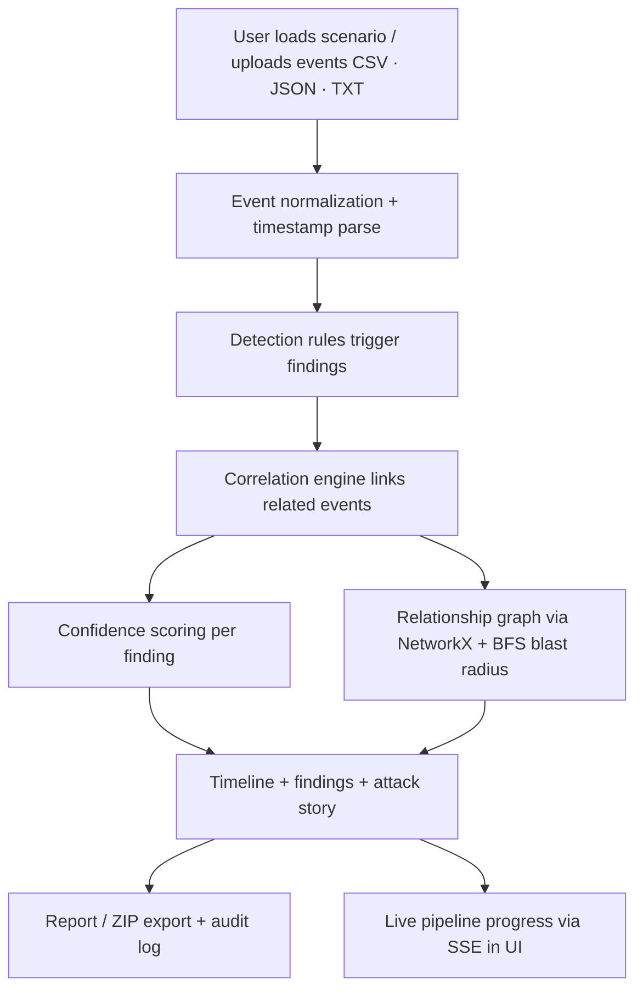

# TraceLine — SOC Analyst Incident Investigation Assistant

TraceLine is a hackathon prototype/MVP: a threat-hunting and incident-investigation assistive tool for SOC analysts. It ingests timestamped security events from CSV/JSON/TXT, normalizes them, runs deterministic detection rules, and produces confidence-scored findings, a timeline, relationship graph, blast-radius estimate, attack story, report and exports — with hash-chained audit logging, a live SSE pipeline-progress UI, and YAML-tunable heuristics.

**GitHub Repository:** https://github.com/gopinath112006-max/TrackX

## 1. Team Details

| Field | Details |
|-------|---------|
| Team Name | Hackers |
| Team Leader | Gopinath AK |
| Register Number | 24TD0034 |
| College | Rajiv Gandhi College of Engineering and Technology |
| Domain | Cybersecurity |

**Additional team members:**

| Name | Register Number | Role |
|------|-----------------|------|
| Sarvalakshmi M | 25TD0023 | Problem-statement analysis & architecture; documentation/PPT |
| Akash M | 24UEC012 | Frontend design & implementation |

---

## 2. Problem Statement

### Problem

SOC analysts are often overwhelmed by large volumes of timestamped security events (authentication logs, firewall / proxy / SIEM exports). Manually correlating these events to find a coherent attack narrative is:

- **Time-consuming** — analysts must manually read and link events across sources.
- **Error-prone** — context needed to connect and explain events is easy to miss.
- **Hard to evidence** — findings lack a clear, verifiable link back to the supporting events and may not reflect how confident the system is in each conclusion.

The specific problem this project addresses: transforming raw, timestamped security events into a structured, confidence-scored incident narrative with traceable evidence — quickly enough to support a SOC investigation workflow.

### Target Users

- Security Operations Center (SOC) analysts.
- Incident responders / threat hunters triaging event logs.
- Non-specialist reviewers (e.g., managers, judges) who need the investigation presented as an understandable story with supporting references.

### Importance

- Attack chains are composed of many low-severity events that only make sense when correlated.
- Automating normalization, detection, correlation, and story generation lets analysts focus on judgment instead of manual linking.
- Clear confidence scoring and evidence citations make findings defensible and auditable — important for incident documentation and compliance-style review.

The significance of the problem is supported by industry evidence:

| Evidence | Source |
|----------|--------|
| **73%** of organizations list false positives as their **#1 detection challenge** | SANS 2025 Detection & Response Survey |
| **51%** of SOC teams feel overwhelmed by alert volume; analysts spend **over 25%** of their time handling false positives | Tariq et al., "Alert Fatigue in Security Operations Centres," ACM Computing Surveys, 2025 |
| A typical SOC receives roughly **960 alerts per day**, with an estimated **50–80%** being false positives | Praetorian, Security 101: Alert Fatigue & False Positives |
| Global average **cost** of a data breach: **USD 4.44 million**; mean time to **identify and contain a breach: 241 days**; breaches started with **compromised/stolen credentials** take the 4th longest to identify (~**186 days**) and ~**246 days** to identify and contain overall | IBM Cost of a Data Breach Report 2025 |
| Organizations using **AI and automation extensively** reduce mean time to identify and contain a breach by an average of **~80 days** versus those that do not | IBM Cost of a Data Breach Report 2025 |

These figures point to a clear need: reducing alert noise and detection/analysis time directly reduces breach impact, which is exactly where an automated log-normalization + detection + correlation + story-generation tool fits.

---

## 3. Proposed Solution

### Solution Overview

TraceLine is a web-based prototype that:

1. Ingests timestamped security events from CSV, JSON, or TXT files.
2. Normalizes them into a consistent internal structure.
3. Applies deterministic detection rules and correlates related events.
4. Produces findings with confidence scoring, a timeline, a relationship graph, a blast-radius estimate, and an automatically generated attack story.
5. Lets the user browse, filter, audit, and export the investigation via a web UI and REST API.

It is presented as a prototype/MVP, not a production system.

### Key Features

#### Implemented in MVP

| Feature | Purpose |
|---------|---------|
| Multi-format event ingestion (CSV / JSON / TXT) | Import raw security events into the system |
| Event normalization | Convert heterogeneous inputs into one consistent schema with a unique `event_id` and provenance `raw_ref` |
| Robust timestamp parsing | Parse and reconcile timestamps across formats |
| Detection rules (9 rules) | Flag suspicious behavior: brute force, unusual-IP login, sensitive-file access, many downloads, data exfiltration, lateral movement, login outside normal hours, privilege escalation, persistence |
| Confidence scoring | Quantify how strongly evidence supports a finding |
| Correlation engine | Relate events that belong to the same attack flow |
| Relationship graph (NetworkX) + BFS blast radius | Model entities and connections; estimate affected trusted assets |
| Entry-point detection | Identify the initial infection vector |
| Timeline & findings views | Present the analysis in a scannable structure |
| Attack story generation | Convert findings into a readable narrative with `[Ref: EVT-xxxx]` citations and inferred-vs-observed tagging |
| Report & ZIP export | PDF report (ReportLab) and ZIP bundle (events.csv, findings.json, iocs.csv, blast_radius.json, attack_path.json, incident_report.pdf) |
| Hash-chained audit logging | Tamper-evident log of user actions |
| Live pipeline-progress (SSE) | Show analysis stages streaming in the UI |
| Advanced event filtering (status, source, date range, etc.) | Let analysts refine the event list |
| YAML-tunable analysis configuration | Externalize heuristics/thresholds for operational control |
| Parallel ingestion | Order-preserving parallel ingestion of large inputs (defaults to sequential for small inputs) |
| Scenario loader & dashboard | Load built-in demo scenarios and view investigation summary metrics |
| Docker packaging | Containerized backend (uvicorn) + frontend (nginx) — config validated via `docker compose config`; full container runtime not verified in the demo environment |

#### Planned / Future Enhancement

| Feature | Purpose |
|---------|---------|
| ML / fine-tuned-model-assisted detection | Machine-learning-driven detection on top of the current rule-based output (no ML code present in the prototype) |
| Streaming / large-scale ingestion and additional log formats | Ingest high-volume streaming feeds beyond the current batch CSV/JSON/TXT files |
| Verified end-to-end container deployment in CI | Build and run the Docker stack in an automated pipeline |
| Interactive graph visualization enhancements | More advanced, analyst-facing graph interactions on top of the current NetworkX output |

### How It Solves the Problem

| Problem | Proposed Solution | Expected Benefit |
|---------|-------------------|------------------|
| Manual event correlation is slow and error-prone | Automatic normalization + correlation engine + relationship graph | Faster, more consistent linkage of related events |
| Findings lack evidence traceability | `raw_ref` provenance + `[Ref: EVT-xxxx]` citations in the story | Every finding is traceable to supporting events |
| Confidence is unclear | Deterministic confidence scoring | Analysts know how strongly evidence supports each finding |
| Attack narrative is hard to communicate | Generated attack story with observed/inferred tagging | Understandable, defensible incident write-ups |
| Actions are not auditable | Hash-chained audit logging | Tamper-evident record of user actions |
| Large log volumes are slow to process | Order-preserving parallel ingestion | Faster throughput while keeping output deterministic |

---

## 4. Approach / Methodology



### Stage-by-stage explanation

1. **Input** — The user loads a demo scenario or uploads security events in CSV, JSON, or TXT format.
2. **Input processing (normalization)** — Raw records are normalized to a consistent schema; each event gets a sequential `event_id` and a `raw_ref` pointing back to its source line. Timestamps are parsed/standardized. Large inputs are processed with order-preserving parallelization that falls back to sequential for small datasets (to keep results deterministic).
3. **Core processing / analysis** — Detection rules (brute force, data theft, lateral movement, stolen credentials) flag suspicious behavior; the correlation engine links related events; each finding receives a confidence score using YAML-tunable weights.
4. **Graph / blast radius** — Entities and their relationships are modeled with NetworkX, and a BFS traversal estimates the blast radius / affected trusted assets.
5. **Decision / output** — Results are assembled into a timeline, findings list, relationship graph, and an automatically generated attack story with evidence citations; the user can filter events, watch pipeline progress over SSE, audit actions, and export a report or ZIP.
6. **Persistence & audit** — Results and a hash-chained audit log are stored in SQLite.

---

## 5. Technology / Tools

### Programming Languages

| Technology | Purpose |
|------------|---------|
| Python 3.12 | Backend application, analysis engine, ingestion, reporting |
| TypeScript | Typed frontend application code |

### Backend

| Technology | Purpose |
|------------|---------|
| FastAPI + Uvicorn | REST API and SSE streaming server |
| SQLAlchemy (SQLite) | Persistence of events, findings, relationships, audit trail |
| NetworkX | Entity/relationship graph and BFS blast-radius traversal |
| Jinja2 | Deterministic attack-story template rendering |
| ReportLab | PDF report generation |
| pandas | Structured parsing of uploaded event files |
| PyYAML | Loading the externalized `analysis_config.yaml` heuristics |
| httpx | HTTP client (used by tests / internal calls) |
| aiofiles | Async file handling for uploads/exports |
| python-multipart | Parsing multipart file uploads |

### Frontend

| Technology | Purpose |
|------------|---------|
| React 18 + Vite | Build the interactive single-page application |
| TypeScript | Static typing for the UI |
| @xyflow/react | Interactive relationship-graph rendering |
| recharts | Charts (timeline / trends) |
| react-dropzone | Drag-and-drop event-file upload |
| react-router-dom | Client-side routing between pages |
| Tailwind CSS | Utility-first styling |
| EventSource (SSE) | Live pipeline-progress updates |

### Deployment / Infrastructure

| Technology | Purpose |
|------------|---------|
| Docker / docker-compose | Containerize backend (Python + uvicorn) and frontend (nginx-served build) |

### Development / Validation Tools

| Technology | Purpose |
|------------|---------|
| pytest | Automated backend test suite (27 tests) |
| tsc / vite build | Frontend type-check and production build |

---

## 6. Expected Output / MVP

### MVP Scope

At the hackathon demo, TraceLine will demonstrate:

- Loading one or more demo scenarios (brute_force, data_theft, lateral_movement, stolen_credentials).
- Automatic normalization and ingestion of events from CSV/JSON/TXT (batch upload via the Upload page or the `/api/evidence/upload` endpoint).
- Detection of suspicious findings (9 detection rules) with confidence scores.
- Entry-point detection of the initial infection vector.
- Correlation and relationship-graph construction with BFS blast-radius estimation.
- A readable attack story with evidence citations (`[Ref: EVT-xxxx]`) and inferred/observed tagging.
- A timeline plus an Explorer with advanced event filtering.
- Event-file upload via drag-and-drop and a report / ZIP export.
- A hash-chained audit log (verifiable via `/api/audit/verify`).
- Live pipeline-progress streaming via SSE in the UI.

### Expected Demonstration

A judge should be able to: open the web UI → load a demo scenario (or drop in an event file) → watch the pipeline progress stream → view findings, timeline, graph, and attack story → filter events → export the report/ZIP → verify the audit log. The backend ships with a 27-test automated suite (all passing) that exercises ingestion determinism, config, story citations, audit integrity, and SSE stages.

### MVP vs Future Scope

| MVP / Currently Demonstrable | Future Enhancement |
|------------------------------|--------------------|
| CSV / JSON / TXT ingestion | Streaming / large-scale ingestion and additional log formats |
| Deterministic rule-based detection + confidence scoring | ML / fine-tuned-model-assisted detection |
| NetworkX relationship graph + BFS blast radius | Deeper graph analytics / interactive visualization |
| Hash-chained audit logging | Role-based access control and full compliance reporting |
| ReportLab PDF + ZIP export | Custom report templates / scheduled reports |
| SQLite persistence | Production database (e.g., PostgreSQL) and horizontal scaling |
| Live SSE pipeline progress | Multi-user collaborative investigation sessions |
| Docker packaging (config validated) | Verified end-to-end container deployment in CI |

---

## 7. Team Roles

| Member | Role | Responsibilities |
|--------|------|------------------|
| Gopinath AK (Team Lead) | Backend build | Solution derivation and backend build |
| Sarvalakshmi M | Problem-statement analysis & architecture | Problem solving on the problem statement; preparing the presentation/PPT and the README |
| Akash M | Frontend | Frontend design and implementation |

---

## 8. Feasibility

### Technical Feasibility

All core technologies (Python 3.12, FastAPI/Uvicorn, SQLAlchemy/SQLite, NetworkX, Jinja2, ReportLab, React/TypeScript/Vite, pytest) are mainstream, open-source, and freely available. The frontend graph/chart libraries (`@xyflow/react`, `recharts`) and Tailwind CSS are standard tooling. No proprietary APIs or paid services are required for the MVP.

### Implementation Feasibility

The MVP was implemented incrementally in phases (rename/parsing → detection/confidence/graph → exports/story/SSE/audit → config/parallel-ingestion/Docker), with a full automated test suite passing at each stage. The analysis pipeline is deterministic and self-contained, so the core feature set fits comfortably within a hackathon duration.

### Resource Feasibility

- **Hardware:** standard development machines (no GPUs or special hardware required).
- **Software / dev environments:** Python 3.12, Node.js/npm, Docker CLI + Compose, Vite, FastAPI, uvicorn.
- **APIs / datasets:** built-in demo scenarios provided by the project; no external paid APIs required.
- **Open-source stack:** all dependencies are open source.

> Note: Docker Desktop was installed and `docker compose config` validates the packaging, but the Linux engine daemon was not running in the demo environment, so a full container build/run was not executed. This is an environment limitation, not a code limitation.

### Scope Feasibility

The project stays achievable by focusing on a deterministic, rule-based MVP: the highest-value slice (ingest → detect → correlate → visualize → report) is fully demonstrable, while optional enhancements (ML models) are explicitly deferred to future work.

### Scalability / Future Expansion

After the hackathon, the prototype could be extended with ML-assisted detection, additional log formats, stronger graph analytics, a production database, RBAC, and verified end-to-end container deployment. These are future directions, not current functionality.

### Why the MVP is achievable

The implementation already exists as a working prototype with a validated 27-test automated suite, built entirely from freely available open-source tools, and scoped to a deterministic core — so it can be demonstrated and evaluated reliably within a hackathon.

---

## 9. References / Data Sources

### Research papers

These two papers directly relate to TraceLine's problem statement — reconstructing multi-step attacks from lightweight security logs via event correlation, relationship modeling, and narrative reconstruction:

**Paper 1 — MuSAR: Multi-Step Attack Reconstruction from Lightweight Security Logs via Event-Level Semantic Association in Multi-Host Environments**
- Authors: Yang Liu, Zisen Xu, Zian Luo, Jin'ao Shang, Shilong Zhang, Haichuan Zhang, Ting Liu
- Venue: 28th International Symposium on Research in Attacks, Intrusions and Defenses (RAID 2025), IEEE, Gold Coast, Australia
- Year: 2025
- DOI: 10.1109/RAID67961.2025.00038
- Relatedness: MuSAR reconstructs multi-step attacks in multi-host environments from lightweight security logs (network alarms and application logs) using event-level semantic association — directly analogous to TraceLine's normalize → correlate → relationship-graph → reconstruct workflow. Its finding that such attacks "typically exhibit hop-based patterns with evidence dispersed across semantically complementary log sources" mirrors TraceLine's cross-source correlation of login, file-access, and network logs.

**Paper 2 — Hidden Markov Models and Alert Correlations for the Prediction of Advanced Persistent Threats**
- Authors: Ibrahim Ghafir, Konstantinos G. Kyriakopoulos, Sangarapillai Lambotharan, Francisco J. Aparicio-Navarro, Basil AsSadhan, Hamad Binsalleeh, Diab M. Diab
- Venue: IEEE Access, vol. 7, pp. 99508–99520
- Year: 2019
- DOI: 10.1109/ACCESS.2019.2930200
- Relatedness: This work models multi-stage/advanced threats by correlating alerts across attack stages. TraceLine shares the same core idea — treating an incident as a sequence of correlated events mapped to an attack lifecycle — while using deterministic rule-based detection and graph reconstruction rather than HMM probability modeling.

### Problem-context evidence (web sources)

| Evidence | Source / URL |
|----------|--------------|
| False positives are the **#1 detection challenge** for **73%** of organizations | SANS 2025 Detection & Response Survey (Stamus Networks summary) — https://www.stamus-networks.com/blog/what-the-2025-sans-detection-response-survey-reveals-false-positives-alert-fatigue-are-worsening |
| **51%** of SOC teams overwhelmed by alert volume; analysts spend **>25%** of time on false positives | Tariq et al., "Alert Fatigue in Security Operations Centres," ACM Computing Surveys, 2025 — https://doi.org/10.1145/3723158 |
| Average SOC receives ~**960 alerts/day**; **50–80%** false positives | Praetorian, Security 101: Alert Fatigue & False Positives — https://www.praetorian.com/security-101/alert-fatigue-and-false-positives/ |
| Average breach cost **USD 4.44M**; **241 days** to identify and contain; stolen-credential breaches ~**246 days** | IBM Cost of a Data Breach Report 2025 — https://www.ibm.com/reports/data-breach |

### Project-internal specification documents

| Resource | Source | Purpose |
|----------|--------|---------|
| FR.md | Project repository (root) | Functional requirements, incl. FR-05.x, FR-08.x, FR-10.x, FR-12.x, FR-14–FR-16 |
| NFR.md | Project repository (root) | Non-functional requirements, incl. NFR-P-02 (parallelism), NFR-M-03 (config), NFR-D-01 (Docker), NFR-R-01 (determinism) |
| workflow.md | Project repository (root) | Analysis workflow definition |
| architecture.md | Project repository (root) | System architecture |

### Demo scenarios

The demo scenarios (`brute_force`, `data_theft`, `lateral_movement`, `stolen_credentials`) are **project-internal test fixtures** created for demonstration and testing. They are not external/provided datasets requiring citation. The generated brute-force login/file-access data mirrors the `brute_force` scenario format described in the "Demo Data" section above.

---

## Additional Sections

### Installation / Setup

**Prerequisites:**
- Python 3.12+ (developed against Python 3.12.9)
- Node.js / npm (Node 18+; verified against Node 24 / npm 11)
- Optional: Docker CLI + Compose (only for the containerized option)

**Backend dependencies** (`backend/requirements.txt`):

```
fastapi>=0.115,<1.0
uvicorn[standard]>=0.30.0
pydantic>=2.13,<3
pydantic-settings>=2.0
sqlalchemy>=2.0
python-multipart>=0.0.9
pandas>=2.0
aiofiles>=24.0
pytest>=8.0
httpx>=0.27.0
networkx>=3.0
PyYAML>=6.0
Jinja2>=3.1
```

**Frontend dependencies** (`frontend/package.json`) — `@xyflow/react` (relationship graph), `recharts` (charts), `react-dropzone` (file upload), `react-router-dom` (routing), `lucide-react` (icons), `tailwindcss` + `postcss`/`autoprefixer` (styling), `typescript`, `vite`, `@vitejs/plugin-react`.

**Install & run backend:**
```bash
cd backend
pip install -r requirements.txt
uvicorn app.main:app --host 0.0.0.0 --port 8000
```

**Install & run frontend (separate terminal):**
```bash
cd frontend
npm install
npm run dev
```

Then open **http://localhost:5173**. The Vite dev server (`frontend/vite.config.ts`) is configured to proxy `/api` requests to `http://localhost:8000`, so no extra proxy configuration is needed for local development.

**Run backend tests (27 tests):**
```bash
cd backend
python -m pytest tests/ -q
```

**Frontend type-check + production build:**
```bash
cd frontend
npm run build   # runs `tsc && vite build`
```

**Docker (optional — requires a running Docker Linux engine):**
```bash
docker compose up --build -d   # then open http://localhost:5173
```

### Environment Variables / Configuration

All three variables are **optional** — the application runs out of the box with its defaults, so no environment configuration is strictly required for the MVP. Values are read from the process environment at startup and may be set in the shell before launching uvicorn (or in the docker-compose environment).

| Variable | Purpose | Required? | Default | Example / Format | Where to configure |
|----------|---------|-----------|---------|------------------|--------------------|
| `TRACELINE_DATABASE_URL` | Override the database connection (used for Docker volume mounts / Postgres, per NFR-D-01) | Optional | `backend/traceline.db` (SQLite file) | `sqlite:///C:/path/traceline.db` (Windows) or `sqlite:////app/data/traceline.db` (Docker/Linux) | Shell env / docker-compose `environment:` |
| `TRACELINE_AUDIT_LOG` | Override the audit-log file path; default is `backend/audit.log` | Optional | `backend/audit.log` | `<absolute-path>\audit.log` | Shell env / docker-compose `environment:` |
| `TRACELINE_CONFIG` | Override the YAML analysis-config file path; default is `config/analysis_config.yaml` relative to the backend | Optional | `config/analysis_config.yaml` (relative to backend) | `<absolute-path>\analysis_config.yaml` | Shell env / docker-compose `environment:` |

### Usage

1. Open the web UI at **http://localhost:5173**.
2. On the **Scenarios** page, load one of the demo scenarios (brute_force, data_theft, lateral_movement, stolen_credentials), or on the **Upload** page drag-and-drop an event file (CSV/JSON/TXT) onto the upload area.
3. Watch the **Pipeline monitor** on the Investigation page stream the analysis stages live (correlation → detection → entry point → graph → blast radius → timeline → confidence → story) via SSE.
4. Explore the results: **Dashboard** (summary metrics), **Findings** (confidence-scored detections), **Timeline**, **Relationships** (interactive graph), **Correlations**, **Story** (auto-generated narrative with `[Ref: EVT-xxxx]` citations), and **Report**.
5. Use the **Explorer** advanced filters (source IP, status, log source, date range) to refine the event list.
6. Verify the audit trail via the **Audit** endpoint (`GET /api/audit` and `GET /api/audit/verify`) and export the PDF / ZIP (`GET /api/report/pdf`, `GET /api/export/zip`).

### Demo Data: Generated Brute-Force Scenario

TraceLine ships with project-internal demo scenarios under `data/scenarios/` (created for demonstration and testing; not external datasets). The **brute_force** scenario demonstrates the FR-05.1 detection rule: multiple failed logins exceeding a threshold within a 15-minute window, followed by a successful login (account compromise), then access to sensitive files.

The `login_logs.csv` follows this schema (generated to mirror realistic authentication log fields):

```
timestamp,user,source_ip,destination_host,action,status
```

Representative rows from the generated brute-force sequence (attacker IP `192.168.1.50`):

| timestamp | user | source_ip | destination_host | action | status |
|-----------|------|-----------|------------------|--------|--------|
| 2026-09-01 21:55:01 | admin | 192.168.1.50 | server01 | LOGIN | FAILED |
| 2026-09-01 21:55:47 | admin | 192.168.1.50 | server01 | LOGIN | FAILED |
| 2026-09-01 21:56:22 | admin | 192.168.1.50 | server01 | LOGIN | FAILED |
| 2026-09-01 21:56:58 | admin | 192.168.1.50 | server01 | LOGIN | FAILED |
| 2026-09-01 21:57:31 | admin | 192.168.1.50 | server01 | LOGIN | FAILED |
| 2026-09-01 21:58:19 | admin | 192.168.1.50 | server01 | LOGIN | FAILED |
| 2026-09-01 21:59:03 | admin | 192.168.1.50 | server01 | LOGIN | FAILED |
| 2026-09-01 21:59:51 | admin | 192.168.1.50 | server01 | LOGIN | FAILED |
| 2026-09-01 22:00:33 | admin | 192.168.1.50 | server01 | LOGIN | FAILED |
| 2026-09-01 22:01:17 | admin | 192.168.1.50 | server01 | LOGIN | FAILED |
| 2026-09-01 22:01:42 | admin | 192.168.1.50 | server01 | LOGIN | SUCCESS |
| 2026-09-01 22:02:05 | admin | 192.168.1.50 | server01 | LOGIN | SUCCESS |

The burst of 10 FAILED attempts (within the ~6-minute span shown) exceeds the `failed_login_burst_threshold` of 5 within the 900-second window and is followed by a SUCCESS, so the rule reports **"Possible brute-force attack"** (HIGH severity, confidence ~90%) for user `admin` from `192.168.1.50`. A subsequent `file_access_logs.csv` sequence shows the same account reading sensitive files (`students.xlsx`, `financial_data.csv`, `employee_records.db`, `salary_data.csv`) after the compromise, triggering the **"Possible unauthorized sensitive-file access"** finding.

### Project Structure

```
Hackers/
├── backend/
│   ├── app/
│   │   ├── main.py               # FastAPI app entrypoint; DB init
│   │   ├── config.py             # YAML analysis-config loader
│   │   ├── analysis/             # detection, correlation, confidence, story, blast_radius, engine
│   │   ├── routes/               # API routes (events, progress/SSE, audit, export, evidence, ...)
│   │   ├── services/             # normalizer, evidence_parser, audit_logger, export_service, ...
│   │   ├── models/               # SQLAlchemy ORM models
│   │   └── utils/                # parallel_map, helpers
│   ├── config/
│   │   └── analysis_config.yaml  # externalized heuristics / thresholds
│   ├── tests/                    # pytest suite (27 tests)
│   ├── requirements.txt
│   ├── Dockerfile
│   └── .dockerignore
├── frontend/
│   ├── src/
│   │   ├── pages/                # Dashboard, Explorer, Findings, Story, Relationships, Upload, ...
│   │   ├── components/           # EventDetailModal, Layout, ui
│   │   ├── hooks/useInvestigation.tsx
│   │   ├── services/api.ts       # API + SSE client
│   │   ├── types/index.ts
│   │   └── ...
│   ├── vite.config.ts            # dev proxy /api -> :8000
│   ├── package.json
│   ├── Dockerfile
│   ├── nginx.conf
│   └── .dockerignore
├── data/
│   └── scenarios/                # demo fixtures (brute_force, data_theft, lateral_movement, stolen_credentials)
│       └── <scenario>/           # login_logs.csv, file_access_logs.csv, network_logs.csv, scenario.json
├── docker-compose.yml
├── FR.md
├── NFR.md
├── workflow.md
└── architecture.md
```

### Future Scope

Separate from the MVP:

- ML / fine-tuned-model-assisted detection.
- Streaming and additional log formats; large-scale ingestion.
- Richer graph analytics and interactive visualization.
- Production database and horizontal scaling; CI-verified container deployment.
- RBAC and collaborative multi-user sessions; custom report templates / scheduled exports.
- Live runtime reconfiguration of YAML-tunable heuristics.

---

> **Status note:** This document describes a hackathon prototype/MVP. Features listed under "Implemented in MVP" correspond to the current working implementation; everything else is planned. The "27 passing tests" figure reflects the number of tests observed passing during development; no performance or accuracy claims beyond direct observation are made.
