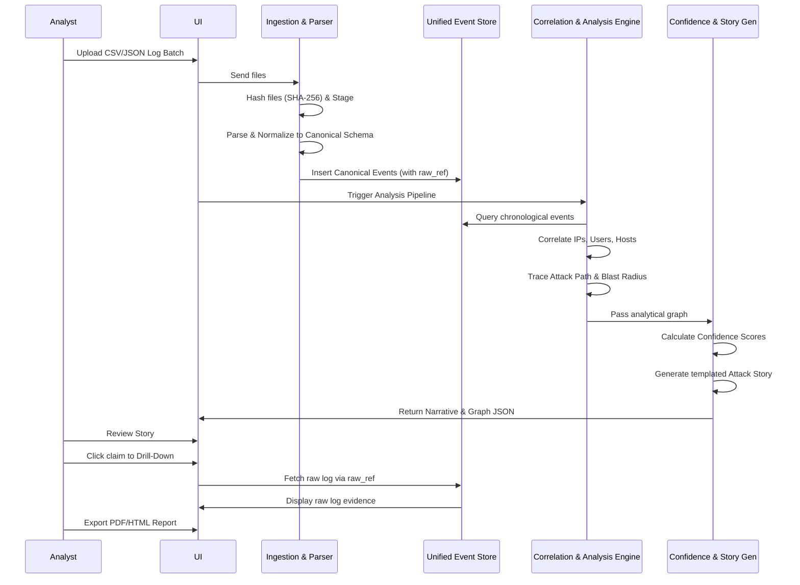

# Detailed Workflow Specification

**Project:** TraceLine — Automated Digital Forensics Reconstruction & Attack Story Pipeline  
**Version:** 1.0.0

This document details the end-to-end operational workflow of TraceLine, mapping how raw evidence transforms into a scored, legally defensible attack story.

---

## 1. High-Level Process Flow

The TraceLine workflow follows the **Scatter-to-Story** paradigm:
`Evidence Upload -> Normalization -> Temporal Sync -> Path Tracing -> Confidence Scoring -> Narrative Generation -> Analyst Review`

---

## 2. Stage-by-Stage Workflow

### Stage 1: Evidence Ingestion
1. **Analyst Action:** The investigator opens the local TraceLine UI and drags-and-drops a batch of log files (CSV/JSON formats).
2. **System Validation:** The UI validates the file extensions and batch size.
3. **Storage & Audit:** The backend receives the batch, calculates SHA-256 hashes for each file to ensure forensic integrity, and stages them immutably.
4. **Task Dispatch:** The Ingestion pipeline queues the files for parallel parsing based on their identified types (Auth, File Access, OS Events, Network).

### Stage 2: Parsing & Normalization
1. **Source Parsing:** Dedicated parser modules extract fields specific to each log type.
2. **Canonical Mapping:** The normalizer maps heterogeneous fields to the Canonical Event Schema (e.g., standardizing `user_id`, `loginName`, and `username` into `principal_id`).
3. **Temporal Standardization:** All timestamps are converted to UTC ISO 8601, correcting for known clock skews.
4. **Provenance Tagging:** The system attaches a `raw_ref` pointer to every canonical event, linking it exactly to the source file and line number.
5. **Database Commit:** The normalized events are bulk-inserted into the Unified Event Store (SQLite/Postgres).

### Stage 3: Timeline & Correlation Construction
1. **Temporal Sorting:** The Timeline Builder queries the Event Store to create an unbroken chronological sequence of all events.
2. **Entity Extraction:** The Correlation Engine identifies unique actors (IPs, users, hostnames) and assets (files, endpoints).
3. **Graphing Edges:** The system draws relationships:
   - *User X authenticated from IP Y*
   - *IP Y connected to Host Z*
   - *Host Z accessed File F*

### Stage 4: Analysis & Pattern Detection
1. **Entry Point Identification:** The heuristic engine scans the timeline for the first anomalous external connection or failed authentication burst, ranking candidates for the "Patient Zero" entry point.
2. **Path Tracing (Kill-Chain):** From the entry point, the Activity Graph Tracer walks forward in time, linking lateral movement, privilege escalation (e.g., standard user to root), and data staging.
3. **Blast Radius Calculation:** The system maps all nodes explicitly touched by the attacker (Compromised) and those structurally reachable from compromised nodes (At-Risk).
4. **Anomaly Scoring:** Suspicious patterns (e.g., off-hours access, disguised admin accounts) are flagged.

### Stage 5: Confidence Calculation
1. **Independent Verification:** The Confidence Engine evaluates each path segment. If a lateral movement is seen in *both* OS Event logs and Network Flow logs, it receives a **High** confidence score.
2. **Penalty Application:** If a time gap exists or data is inferred without explicit logs, the score is penalized to **Medium** or **Low**.
3. **Rationale Generation:** A deterministic explanation string is attached to every score (e.g., "High Confidence: Corroborated by network proxy log and endpoint process log").

### Stage 6: Attack Story Synthesis
1. **Template Mapping:** The Story Generator takes the scored event sequence and maps it to natural language templates.
2. **Narrative Construction:** The text is stitched chronologically, citing the `raw_ref` for every claim.
3. **LLM Formatting (Optional/Constrained):** A heavily constrained LLM (temperature 0.0) formats the templated text into a highly readable report, maintaining strict factual adherence.

### Stage 7: Investigation & Export
1. **Analyst Review:** The investigator views the generated Attack Story in the UI.
2. **Drill-Down Validation:** The analyst clicks on a specific narrative claim. The UI instantly queries the Event Store via `raw_ref` and displays the raw log lines within 500ms.
3. **Report Generation:** The finalized timeline, blast radius metrics, and narrative are exported as an HTML/PDF incident report and JSON machine-readable artifact.

---

## 3. Workflow Diagram (Mermaid)

